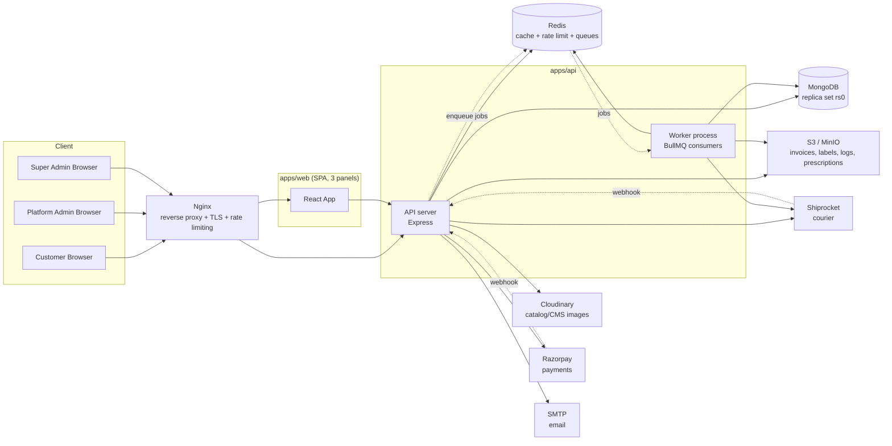
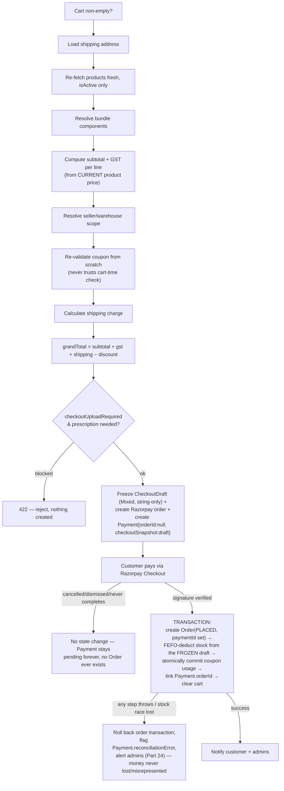

# MedWeb — Feature & Business Logic Documentation

**Scope**: This document describes the system **as it is actually implemented** in the codebase at the time of writing (verified against `apps/api`, `apps/web`, `packages/shared`, and `infra/`). It is not a design spec and not a rewrite of the earlier reverse-engineered reference docs (`MEDICAL_ECOMMERCE_BUSINESS_LOGIC.md`, `UNIWARE_USER_ACTIVITY_AUDIT_LOGIC.md`) that live at the repo root — those describe a *different* system (Uniware/Unicommerce) used only as design inspiration. Every claim below was verified by reading the actual source; where something could not be confirmed, or exists in code but appears unused, it is called out explicitly with the tag **`DOCUMENTED BUT NOT CURRENTLY IMPLEMENTED`** or **`DEAD CODE / UNUSED`**.

Audience: Developers, Senior Engineers, System Architects, QA, Platform Admins, Super Admins, and Business Owners. Each feature is explained as: **Purpose → Users involved → Business logic → Permissions → Data affected → Connected modules → Rules → Integrations**.

---

## Table of Contents

1. [System Overview](#part-1--system-overview)
2. [Users / Roles / Entities](#part-2--users--roles--entities)
3. [Super Admin](#part-3--super-admin)
4. [Platform Admin](#part-4--platform-admin)
5. [Configuration-Driven Architecture](#part-5--configuration-driven-architecture)
6. [Authentication](#part-6--authentication)
7. [Authorization / RBAC / PBAC](#part-7--authorization--rbac--pbac)
8. [Customer / User Profile](#part-8--customer--user-profile)
9. [Product Management](#part-9--product-management)
10. [Cloudinary (Catalog Images)](#part-10--cloudinary-catalog-images)
11. [Inventory](#part-11--inventory)
12. [Cart](#part-12--cart)
13. [Coupon System](#part-13--coupon-system)
14. [GST / Tax](#part-14--gst--tax)
15. [Shipping](#part-15--shipping)
16. [Order Management](#part-16--order-management)
17. [Razorpay Payment](#part-17--razorpay-payment)
18. [Shiprocket](#part-18--shiprocket)
19. [Prescription](#part-19--prescription)
20. [Invoice](#part-20--invoice)
21. [S3 / Object Storage](#part-21--s3--object-storage)
22. [Logging System](#part-22--logging-system)
23. [Notification System](#part-23--notification-system)
24. [Audit System](#part-24--audit-system)
25. [Background Jobs / Cron](#part-25--background-jobs--cron)
26. [Admin CRUD Pattern](#part-26--admin-crud-pattern)
27. [Database Entities](#part-27--database-entities)
28. [Data Flow](#part-28--data-flow)
29. [Error Handling](#part-29--error-handling)
30. [Security Model](#part-30--security-model)
31. [Feature Configuration Matrix](#part-31--feature-configuration-matrix)
32. [Integration Matrix](#part-32--integration-matrix)
33. [Final Feature Checklist](#part-33--final-feature-checklist)

---

## PART 1 — SYSTEM OVERVIEW

MedWeb is a medical e-commerce platform built as an **npm-workspaces / Turborepo monorepo**:

- **`apps/api`** — Node.js + TypeScript + Express backend, Mongoose/MongoDB, Redis (caching, rate limiting, RBAC cache), BullMQ (background queues).
- **`apps/web`** — React 19 SPA (Vite, TanStack Query/Table, react-router-dom v7, Tailwind CSS), serving three panels from one codebase: **Customer**, **Platform Admin**, **Super Admin**.
- **`packages/shared`** — Zod schemas and constants (roles, permissions, order/payment/coupon enums, GST state codes, env schema) shared by both apps and built to CJS+ESM.
- **`packages/config`** — declared as a workspace in root `package.json` but **currently contains no files** (empty/reserved workspace slot).
- **`infra/`** — Docker Compose stacks (dev/prod/monitoring), Nginx reverse proxy, Prometheus/Grafana monitoring, backup/deploy/firewall scripts.

### Runtime processes

The API backend runs as **two separate Node processes** built from the same image:

- **`api`** (`server.ts`) — the Express HTTP server. Boots the DB connection, mounts all routes, starts its own per-process log-archival scheduler and pool-stats sampler. Runs with 2 replicas in production (`infra/docker/docker-compose.prod.yml`).
- **`worker`** (`worker.ts`) — no HTTP server at all. Starts 4 BullMQ `Worker` consumers (invoice, notification, shipment, maintenance), registers all 7 recurring maintenance cron jobs, and configures the S3 log-retention lifecycle rule. Runs with 1 replica.

Both processes import `models.registry.ts` (a side-effect-only import of all 18 domain model barrels covering 79 Mongoose models) so every collection is registered regardless of which process starts first.

### Component connections



### Component roles

| Component | Role |
|---|---|
| **Customer Panel** | `/account/*` — browsing, cart, checkout, orders, prescriptions, returns. Any authenticated user. |
| **Platform Admin Panel** | `/admin/*` — day-to-day operations: catalog, inventory, orders, payments, coupons, CMS, reports. Roles `admin`/`inventory_manager` (scoped). |
| **Super Admin Panel** | `/admin/super/*` — platform configuration: roles/permissions, admin users, feature flags, raw configuration, dynamic menu, security center. Role `super_admin` only. |
| **Backend (`api`)** | Stateless REST API; all business logic, RBAC enforcement, validation. |
| **Backend (`worker`)** | Async processing: invoice PDF generation, notification dispatch, Shiprocket fulfillment, all cron/maintenance jobs. |
| **MongoDB** | Single system of record, single-node replica set `rs0` (required for Mongoose multi-document transactions used in checkout, coupon redemption, stock adjustments, GRN, returns). |
| **Redis** | RBAC/permission cache (60s TTL), account-status cache, blocked-IP cache, rate-limit counters (`rate-limit-redis`), BullMQ queue backend (separate connection from the cache client). |
| **Cloudinary** | Direct-from-browser signed image uploads: product images, CMS media, profile pictures, prescription images (legacy path), return evidence. |
| **S3-compatible storage** (AWS S3 in production, MinIO in local dev) | Generated business documents: invoice PDFs, shipping/return labels, compressed log archives, and the primary path for prescription uploads (with Cloudinary as automatic fallback when S3 isn't configured). |
| **Razorpay** | Payment order creation, checkout, signature-verified payment capture, refunds, webhook-driven state sync. |
| **Shiprocket** | Courier order creation, AWB assignment, label retrieval, tracking webhooks, reverse-pickup for returns. |
| **Notification system** | Centralized `NotificationService` — email (real, via SMTP/Nodemailer), SMS/WhatsApp/push (log-only stub transports today). |
| **Logging system** | Pino structured JSON logs, 6-hour wall-clock rotation, gzip compression, S3 upload, 20-day S3 retention (lifecycle rule + app-level safety-net sweep). |
| **Configuration system** | A single generic `Configuration` collection (namespaced key/value store) backing per-domain settings (coupons, notifications, prescriptions, analytics, SEO, payment, shipping, GST, Razorpay/Cloudinary/Shiprocket credentials, global/business settings, maintenance mode). |
| **Docker** | Compose-orchestrated: `nginx`, `api`(×2), `worker`(×1), `web`(×2), `mongo`, `redis`, plus dev-only `minio`/`mongo-express` and opt-in `prometheus`/`grafana`/`node-exporter`/`cadvisor`. |
| **Nginx** | The **only** externally-exposed container (80/443). Reverse-proxies `/api/*` to the API upstream and everything else to the static SPA; applies edge-level rate limiting and security headers; TLS termination. |

---

## PART 2 — USERS / ROLES / ENTITIES

### The real role enum

The canonical role list lives in `packages/shared/src/constants/roles.ts`:

```
ROLES = { SUPER_ADMIN: 'super_admin', ADMIN: 'admin', INVENTORY_MANAGER: 'inventory_manager', CUSTOMER: 'customer' }
```

**There are exactly 4 `User.role` values.** There is **no separate `platform_admin` enum value** — "Platform Admin" is a documentation/UI label applied to the `admin` role (and, for audit-attribution purposes, `inventory_manager` too). This is an important terminology note: wherever this document says "Platform Admin," the underlying `User.role` is `admin` or `inventory_manager`.

A second, broader vocabulary exists **only for audit-log attribution** (not for authorization): `ACTOR_TYPES = { CUSTOMER, PLATFORM_ADMIN, SUPER_ADMIN, SELLER, SYSTEM, WEBHOOK, BACKGROUND_JOB }` (`packages/shared/src/constants/auth-events.ts`). `actorTypeForRole()` maps `super_admin → SUPER_ADMIN`, `admin`/`inventory_manager → PLATFORM_ADMIN`, `customer → CUSTOMER`. `ACTOR_TYPES.SELLER` is reserved/unused (there is no `seller` login role).

### Customer

- **Purpose**: browse/buy medical products.
- **Authentication**: email+password registration/login (self-service), or OTP-based login/password-reset if enabled by Super Admin.
- **Authorization**: default seeded permission set is `orders:read` only — nearly everything else a customer does (cart, checkout, prescriptions, reviews, wishlist) is gated purely by `requireAuth` (any logged-in identity) plus **ownership checks in the service layer**, not by the RBAC permission catalog.
- **Accessible panels**: Customer panel (`/account/*`) only.
- **Main capabilities**: browse products, manage cart, apply coupons, checkout, pay (Razorpay), view/cancel orders, upload prescriptions, request returns, view/download own invoices, manage profile/addresses/wishlist/saved medicines, submit reviews.
- **Restrictions**: cannot reach `/admin/*` (frontend `ProtectedRoute` blocks it, and every admin API route independently requires `admin`/`inventory_manager`/`super_admin` role or an explicit permission — a customer JWT is rejected server-side even if the frontend guard were bypassed). Cannot self-register as anything other than `customer` — there is no public admin registration endpoint.
- **Related models**: `User`, `CustomerProfile`, `CustomerAddress`, `Cart`, `Wishlist`, `SavedMedicine`, `PrescriptionUpload`, `Order`, `Review`.
- **Audit/logging**: login/OTP/password events via `recordAuthEvent` → `AuditLog` (resource `auth`); own actions on orders/returns/prescriptions recorded on the relevant domain's audit trail with `actorType: CUSTOMER`.

### Platform Admin (`role: admin`)

- **Purpose**: run day-to-day store operations.
- **Authentication**: created only by a Super Admin (or a delegated `users:update` holder, subject to an escalation guard) via the Admin Users screen — never self-registered. Supports password login and, if enabled, Google OAuth.
- **Authorization**: seeded with full CRUD on nearly every business resource — products, bundles, categories, brands, manufacturers, orders, inventory, warehouses, sellers, batches, suppliers, purchase orders, customers, coupons, invoices, payments, deliveries, shipping, tax, CMS, reports, notifications, audit logs, files, returns, prescriptions — **deliberately excluding** `roles`, `users`, `configuration`, `feature_flags`, `menus` (the Super-Admin-only platform surface).
- **Accessible panels**: Platform Admin panel (`/admin/*`), gated to roles `admin`, `super_admin`, `inventory_manager`.
- **Main capabilities**: full commerce operations (see Part 4).
- **Restrictions**: cannot create/promote a `super_admin` account (server-side tier guard, independent of the RBAC permission check); cannot edit the `super_admin` role's own permissions; cannot grant/revoke sensitive per-user permission overrides (`roles`, `users`, `configuration`, `audit_logs`) even if otherwise holding `users:update`; cannot reach Super-Admin-only config surfaces (Roles, Admin Users, Feature Flags, raw Configuration, Dynamic Menu editor) unless explicitly granted a specific permission override.
- **Related models**: `User` (role `admin`), plus every domain model it operates on.
- **Audit/logging**: every create/update/delete on managed resources is recorded via `recordAudit()`.

### Inventory Manager (`role: inventory_manager`)

- **Purpose**: a narrower operational role scoped to procurement/stock, distinct from full Platform Admin.
- **Authorization**: seeded with `create/read/update/import/export` **only** on `inventory`, `suppliers`, `purchase_orders` — **notably excludes `approve`** (cannot approve stock adjustments, damaged-stock write-offs, or purchase requests) and **excludes `batches`/`warehouses` entirely** (cannot directly hit `/batches/*` or `/warehouses/*` routes without an explicit override).
- **Accessible panels**: Platform Admin panel, but with a much smaller effective menu (RBAC-filtered).
- **Restrictions**: everything not in its allow-list above.

### Super Admin (`role: super_admin`)

- **Purpose**: platform owner/operator — controls configuration, RBAC, and every business surface.
- **Authentication**: the very first Super Admin is created exclusively by the one-time `seed-super-admin.ts` bootstrap script (reads `SUPER_ADMIN_EMAIL`/`SUPER_ADMIN_PASSWORD`/`SUPER_ADMIN_NAME` from env; idempotent — refuses to run if any `super_admin` already exists). All subsequent Super Admins are created by an existing Super Admin through the Admin Users screen.
- **Authorization**: **implicit bypass of all permission checks** — `authorize()` middleware short-circuits with `if (req.user.role === 'super_admin') return next()`. The seed data also grants literally every `resource:action` pair explicitly, but the bypass means Super Admin authority isn't actually contingent on the seeded permission rows.
- **Accessible panels**: Super Admin panel (`/admin/super/*`) plus everything in the Platform Admin panel.
- **Main capabilities**: see Part 3.
- **Restrictions**: none by design — Super Admin is the maximum-trust tier. The only "restriction" is architectural: Super-Admin-only tier guards exist specifically to prevent a *Platform* Admin from self-escalating to this tier, not to restrict Super Admin itself.
- **Related models**: `User` (role `super_admin`), `Role`, `UserPermission`, `Configuration`, `FeatureFlag`, `DynamicMenu`.

### System / Service actors

- **`SYSTEM`** (`ACTOR_TYPES.SYSTEM`) — attributed to server-initiated actions that aren't tied to a specific human or a background job (e.g., automated replacement-order creation during a return resolution).
- **`BACKGROUND_JOB`** — every BullMQ worker handler runs inside `runWithJobContext(jobName, jobId, ...)`, which stamps `actorType: BACKGROUND_JOB` and `jobId`/`jobName` onto the async-local request context, so any audit/log line written during that job is attributable to the job, never to a human.
- **`WEBHOOK`** — actions triggered by Razorpay/Shiprocket webhook deliveries (e.g. payment capture, shipment status updates) are attributed to a webhook actor, not a logged-in user; `actorId` is `null` in these cases, `actorId: null` is explicitly supported by `updateOrderStatus()` for exactly this reason.
- **`SELLER`** (`ACTOR_TYPES.SELLER`) — defined in the actor-type vocabulary but **currently unused**: there is no `seller` login role in `ROLES`. `Seller` is a business entity (the GST-registered legal entity issuing invoices), not a user/login identity.

### Webhook actors (external, unauthenticated by login)

- **Razorpay webhook** — authenticated by HMAC-SHA256 signature over the raw request body (constant-time compared), not by a user session.
- **Shiprocket webhook** — authenticated by a static shared token compared with a constant-time comparison (fails closed if unconfigured).

Both are documented in depth in Parts 17 and 18.

### Roles &amp; Permissions engine (RBAC data model, referenced throughout)

- **`Role`** documents (`RoleModel`) hold `key`, `name`, `permissions: string[]`, `isSystem` (seeded roles cannot be deleted).
- **Permission catalog** is `RESOURCES × ACTIONS` (28 resources × 8 actions: `create, read, update, delete, export, import, refund, approve`), computed in memory by `GET /rbac-admin/permissions` — not read from the `PermissionModel` collection, which exists in schema but has no code that reads/writes it (**dead code**).
- **`RolePermissionModel`** (join table) is documented in its own model comment as "the authoritative role↔permission mapping, with `Role.permissions` as a denormalized cache" — but no code anywhere reads or writes it. `Role.permissions` (the flat array) is the actual, sole source of truth used by `rbac.middleware.ts` and `role.service.ts`. **`DOCUMENTED BUT NOT CURRENTLY IMPLEMENTED`** (the join-table architecture described in the model's own comment).
- **`UserPermission`** — per-user grant/deny override on top of the role (`{userId, permissionKey, effect: grant|deny, expiresAt}`), unique per `(userId, permissionKey)`. Deny always wins over an inherited grant. Only a Super Admin may grant/revoke overrides on sensitive resources (`roles`, `users`, `configuration`, `audit_logs`); no actor can modify their own overrides (self-escalation guard).

### Frontend enforcement vs backend enforcement

Three route groups in the SPA (`AppRouter.tsx`):

| Panel | Path | Guard |
|---|---|---|
| Customer | `/account/*` | `ProtectedRoute` (any authenticated user) |
| Platform Admin | `/admin/*` | `ProtectedRoute requiredRole={['admin','super_admin','inventory_manager']}` |
| Super Admin | `/admin/super/*` | `ProtectedRoute requiredRole={['super_admin']}` |

`ProtectedRoute` and the sidebar's `useVisibleMenu()` both derive their permission set from `GET /auth/me`, which is computed server-side by the **same** `getEffectivePermissions()` function the backend's `authorize()` middleware uses — so frontend hiding and backend enforcement are driven by one shared computation, not two independently-maintained lists. The frontend check is UX convenience (avoid flashing then bouncing a page); the real security boundary is always the server-side `authorize()`/service-layer ownership check, confirmed present on every admin route inspected in this audit.

---

## PART 3 — SUPER ADMIN

Every Super Admin capability found in code, with what actually happens internally.

### 3.1 Roles & Permissions management

- **What**: create/edit/clone roles, edit each role's `permissions[]` array, create/manage per-user permission overrides (grant/deny with optional expiry), create/suspend/unsuspend Platform Admin accounts, reset an admin's password.
- **Who**: Super Admin (implicit); a Platform Admin holding `users:update`/`roles:update` can also reach parts of this, but is blocked by tier guards from touching the `super_admin` role or promoting anyone to it.
- **Business rule**: only `super_admin` may assign the `super_admin` role to any account, manage an existing super-admin account, or edit the `super_admin` role's own permission set. Nobody can modify their own permission overrides.
- **Internally**: writes go to `RoleModel`/`UserPermissionModel`/`User.role`; every write invalidates the relevant Redis cache (`role-permissions:<key>`, user-override cache, account-status cache) so the change takes effect within ~60s even for a JWT that hasn't expired yet.
- **Depends on**: `apps/api/src/modules/auth/{role,admin-user,user-permission}.service.ts`, routes in `rbac-admin.routes.ts`.

### 3.2 Feature Flags

- **What**: 23 seeded boolean flags (`products, inventory, coupons, wishlist, prescription_upload, razorpay, cash_on_delivery, returns, refunds, invoices, reports, analytics, notifications, cms, reviews, shipping, gst, suppliers, warehouses, manufacturers, brands, blogs, offers`), each with `scope` (`global`/`role`/`user`), `targetRoles[]`, `targetUserIds[]`, and a `rolloutPercentage` (0-100) using deterministic SHA-1-hash-based per-subject bucketing (so a partial rollout is stable, not flapping per request).
- **Who**: only Super Admin by default (`feature_flags:update` is excluded from the seeded `admin` role).
- **Effect**: `GET /feature-flags/active` (public/optional-auth) returns the flags applicable to the caller; frontend `useFeatureFlag(key)` hook consumes it. A `requireFeature(key)` backend middleware exists to 404 a route when a flag is off, but **it is not attached to any route anywhere in the codebase** — `DEAD CODE / UNUSED`. In practice, feature flags today gate **frontend visibility/rollout**, not backend API access — this is architecturally distinct from the per-domain config toggles in Part 5, which genuinely do enforce on the backend.

### 3.3 Generic Configuration (raw key/value store)

- **What**: direct edit access to every `Configuration` namespace — `global` (app name/logo/theme/timezone/currency, **maintenance mode**), `business` (GSTIN, invoice/order prefixes), `payment`, `shipping`, `email`, `sms`, `razorpay`, `cloudinary`, `gst`, `cms`, `authentication` (OTP settings, admin Google-login toggle), plus the domain-specific namespaces covered in Part 5.
- **Who**: `configuration:update` — Super-Admin-only by default (excluded from the `admin` seed).
- **Effect**: writes go through `setConfiguration()`, which encrypts secret-shaped field names (`keySecret`, `webhookSecret`, `apiSecret`, `clientSecret`, `secretAccessKey`, `smtpPassword`/`smtpPass`, `privateKey`, `authToken`, `accountSecret`) with AES-256-GCM before persisting, using `CONFIG_ENCRYPTION_KEY`. If that key is unset, values are stored in plaintext with a one-time startup warning rather than the app refusing to boot.

### 3.4 Maintenance Mode

- **What**: a single `boolean` + `message` field inside the `global` configuration namespace.
- **Who**: `configuration:update`.
- **Effect**: `maintenanceModeGate` middleware runs on **every** `/api/v1` request. When on, only `/auth/*` and `/configuration/*` remain reachable for everyone (so an admin can log back in and disable it); any request bearing a valid `admin`/`super_admin` Bearer token also bypasses it; everyone else gets `503 MAINTENANCE_MODE`. Cached in Redis 30s, explicitly invalidated on write.

### 3.5 Dynamic Menu editor

- **What**: full CRUD tree editor for a `DynamicMenu` collection (key, label, icon, path, placement, parent, required permission/role/flag, order).
- **Who**: `menus:*` — Super-Admin-only by default.
- **Effect**: **`DOCUMENTED BUT NOT CURRENTLY IMPLEMENTED` (partially)** — the live admin sidebar does **not** read from this collection. `AdminLayout.tsx` imports static arrays from `apps/web/src/constants/menu.ts`, filtered client-side by `useVisibleMenu()` against the user's role/permission. The `DynamicMenu` page's own in-code comment confirms this: it's "what makes DynamicMenu a real, queryable, admin-editable system rather than an unused model," but migrating the actual sidebar render path to consume it is explicitly deferred. Editing a menu item via this screen today has **no effect** on what any admin sees.

### 3.6 Security Center

- **What**: manage `BlockedIp` records (explicit IP bans, Redis-cached, enforced ahead of every `/api/v1/*` request) and `Device` records (`isBlocked` flag for the push-notification device registry).
- **Who**: reuses `audit_logs:read`/`audit_logs:update` permissions (there is no dedicated `security` resource in the permission catalog).
- **Internally**: IP blocking is a manual admin action — there is **no automatic** IP ban on repeated failed logins in this codebase (brute-force defense instead relies on per-account lockout + rate limiting, see Part 6). Device blocking is a registry action; no code was found wiring `Device.isBlocked` into the actual login/token-verification path — it functions as a Security Center listing/moderation surface for the push-notification device registry, not (currently) a login gate.

### 3.7 Audit / Activity log viewer

- **What**: read-only paginated views over `AuditLogModel` (full before/after change trail) and `ActivityLogModel` (lightweight human-readable trail).
- **Who**: `audit_logs:read`.
- **Note**: `ActivityLogModel` is defined and readable via this screen but has **zero writers anywhere in the codebase** — `DEAD CODE / UNUSED` (currently always empty). The real audit trail is entirely `AuditLogModel`.

### 3.8 Platform Health dashboard

- **What**: API/DB status, uptime, memory, total admins/customers/orders/revenue, active sessions, BullMQ queue health (per-queue active/waiting/failed/completed counts), 24h audit-action counts, security-alert count (suspended/locked accounts in last 24h).
- **Who**: requires `reports:read` **plus** the `platformHealthAnalyticsEnabled` analytics-domain toggle, which **defaults OFF** (deliberately, since it exposes ops/security internals) — even a Platform Admin with full `reports:read` sees this panel only if Super Admin has explicitly turned that specific toggle on.

### 3.9 Delegated domain-specific configuration

Rather than gating coupon/notification/prescription/analytics/SEO settings behind the Super-Admin-only `configuration` permission, each reuses an existing **business** permission it already shares with Platform Admin CRUD on that domain (`coupons:update`, `notifications:update`, `prescriptions:update`, `reports:update`) — so a Super Admin can delegate control of one specific config surface to a Platform Admin without granting broader platform access. This is a deliberate design choice documented directly in the relevant route files. See Part 5 for the full mechanics.

---

## PART 4 — PLATFORM ADMIN

Every Platform Admin module actually present, backed by real routes/services. All use the shared RBAC pattern: `requireAuth` + `authorize(permission(RESOURCE, ACTION))`, with `super_admin` bypassing every check.

| Module | Purpose | Backend | Business rules worth noting |
|---|---|---|---|
| **Product / Bundle / Category / Brand / Manufacturer** | Catalog CRUD | `modules/catalog/*` | Products have no draft/live status enum — only a boolean `isActive`; "publish" = toggling it. Bundle price is independently admin-set, never auto-summed from components. All deletes are soft (never hard). |
| **Inventory** (Warehouses, Suppliers, Batches, Purchase Requests/Orders, GRN, Stock Adjustments/Transfers, Damaged Stock) | Stock and procurement management | `modules/inventory/*` | Stock only ever moves via a transactional service call paired with an immutable `StockMovement` ledger row — never a direct field edit. |
| **Sellers** | Legal/business entities that own warehouses and issue invoices | `modules/sellers/*` | Distinct from Supplier (procurement-side) and from "Seller" as a marketplace-vendor concept — this is the store's own legal entity/branch. |
| **Orders** | Order lifecycle management, manual status transitions | `modules/orders/order.*` | Status changes are constrained by an explicit `ORDER_STATUS_TRANSITIONS` state machine — an invalid transition is rejected with `422`, not silently applied. |
| **Returns** | Return/refund/replacement workflow | `modules/orders/return.*` | QC result (`sellable/damaged/expired/tampered`) automatically decides restock vs write-off — no separate manual restock-approval step. |
| **Shipments** | Manual Shiprocket actions, tracking, labels | `modules/orders/shipment.*` | Manual "force status" update exists and bypasses the shipment state machine (no restriction found beyond writing a tracking event). |
| **Coupons** | Discount-code CRUD + config | `modules/coupons/*` | Only one active coupon per cart (no stacking) — enforced by the schema having a single `couponCode` field on Cart/Order, not by a business rule check. |
| **GST / Tax** | HSN→rate master table + per-product rate history | `modules/tax/*` | `Product.gstRate` is a denormalized cache for fast checkout math; `ProductTaxMapping` is the append-only audit/history trail behind it. |
| **Shipping / Delivery** | Delivery partners, shipping zones/rules | `modules/delivery/*` | Shipping charge resolution is zone → rule (cart-value + optional weight + optional delivery-type tiering), never a flat hardcoded rate. |
| **Invoices** | Invoice listing, download, manual regeneration | `modules/invoices/*`, `modules/admin/invoices.*` | Tax/legal data is frozen at first generation; regeneration only re-renders the PDF from the frozen snapshot, tax is never recomputed. |
| **Prescriptions** | Review queue (approve/reject uploaded Rx) | `modules/customers/prescription.*` | Approval sets `order.prescriptionVerified = true`, which is what a fulfillment-stage gate checks before allowing `PACKED`. |
| **Payments** | Payment/failed-payment listing, manual refunds | `modules/admin/payments.*` | Refund amount is capped at `paidAmount − alreadyRefundedAmount`; refunds are calculated from the order's frozen price snapshot, never re-priced. |
| **Customers** | Customer account listing/detail | `modules/admin/customers.*` | Read/administrative only from this module; customers manage their own profile via the customer-panel profile module. |
| **Notifications** | Template CRUD, delivery history, manual retry/send | `modules/notifications/*` | Templates are validated against a per-key variable whitelist so an admin cannot introduce a template referencing a secret field. |
| **CMS** | Banners, home sections, blogs, FAQs, static pages | `modules/cms/*` | Pure content management, no business-logic side effects. |
| **Analytics / Reports** | Dashboards, sales/GST/inventory/customer reports, search analytics | `modules/admin/{analytics,reports}.*`, `modules/search/*` | Gated by a master `analyticsEnabled` toggle plus 13 independent per-domain toggles. |
| **SEO** | Sitemap/robots/structured-data/AEO/GEO configuration | `modules/search/seo-*` | Disabling a domain toggle actually empties the sitemap/robots output and omits structured data server-side, not just hides an admin field. |

### CRUD depth notes

- **Bulk Excel import** exists only for Products (bespoke, not the generic factory) — 5,000-row cap, real ZIP-magic-byte content sniffing (not trusted MIME), per-row error accumulation (a bad row never aborts the batch).
- **Bulk export** exists for most catalog/inventory entities via a shared `attachBulkAndExportRoutes()` helper (bulk-delete, bulk-edit, Excel export up to 10,000 rows).
- **Bundle** has no bulk operations at all (create/edit/delete only) — confirmed by the frontend hook's own comment stating the backend doesn't support bulk-edit/export/import for Bundle yet.

---

## PART 5 — CONFIGURATION-DRIVEN ARCHITECTURE

This is the mechanism that lets a Super Admin turn business features on/off without a deploy, and — critically — makes that toggle enforceable, not just cosmetic.

### 5.1 The generic store

There is exactly **one** underlying collection, `ConfigurationModel`: one document per `namespace`, `value: Schema.Types.Mixed`. Every "settings page" in the admin UI (Coupon Settings, Notification Settings, Medical Compliance/Prescription Settings, Analytics Settings, SEO Settings, plus the raw Configuration screen for global/business/payment/shipping/email/sms/razorpay/cloudinary/gst/authentication) is a thin, typed wrapper around `getConfiguration(namespace)`/`setConfiguration(namespace, value)` — never a bespoke Mongo collection per domain.

Each domain splits into two files: a pure `*-config.util.ts` (TypeScript interface, `DEFAULT_*_CONFIG`, a dependency-validation function — deliberately free of any DB/Redis import so it's unit-testable in isolation) and a `*-config.service.ts` (reads/writes through the generic engine, plus audit logging on every change, plus a dedicated `*_FEATURE_ENABLED`/`*_FEATURE_DISABLED` audit event specifically when the master switch flips).

**Feature Flags** and **Dynamic Menu** are explicitly *not* part of this generic store — they are their own dedicated Mongoose collections with their own controllers.

### 5.2 The enforcement chain

```
Super Admin toggles a config value
        ↓
ConfigurationModel.value updated (secret-shaped fields encrypted at rest)
        ↓
Platform Admin UI reads the new state (via the domain's GET /.../config route)
        ↓
Frontend conditionally hides/shows UI (convenience — NOT the security boundary)
        ↓
Backend re-checks the SAME config value on every relevant request
   — either via a dedicated route middleware, or an inline service-layer check —
        ↓
Request is rejected (403/422) or business logic branches accordingly,
   REGARDLESS of what the frontend UI showed
```

**The critical point, verified across every config-gated feature in this codebase**: hiding a button/page in the React UI is never sufficient by itself, because the backend independently re-checks the same configuration value before executing the underlying operation. A direct API call (e.g. from a script, Postman, or a compromised frontend build) with an off feature still gets rejected server-side.

### 5.3 Every configurable feature

| Feature | Default state | Config location | Who can change | Effect when ON | Effect when OFF | Backend enforcement |
|---|---|---|---|---|---|---|
| **Coupons** | `managementEnabled: true` | `coupon` namespace | `coupons:update` | Normal coupon CRUD + redemption | `requireCouponManagementEnabled` middleware 403s (`COUPON_FEATURE_DISABLED`) on almost every coupon route; independently re-checked in `validateCouponForCart` at checkout | Real — dedicated middleware **and** inline checkout re-check |
| **First-order-only coupons** | `true` | `coupon` namespace | `coupons:update` | `firstOrderOnly` coupons enforce the rule | Rule skipped even if the coupon has `firstOrderOnly: true` | Inline in `coupon-validation.service.ts` |
| **Notifications (master)** | `notificationsEnabled: true` | `notification` namespace | `notifications:update` | Notifications dispatch normally | `enqueueNotification()` writes a `CANCELLED` history row instead of sending (never a silent drop) | Inline gate inside the dispatch chokepoint; `critical` (OTP/security) sends bypass this specific gate but not the per-channel toggle |
| **Notification channels** (email/sms/whatsapp/push) | all `true` | `notification` namespace | `notifications:update` | Channel used when applicable | That channel's sends are cancelled | Same inline gate |
| **Notification categories** (order/payment/shipping/return/prescription/admin) | all `true` | `notification` namespace | `notifications:update` | Category's notifications sent | Category's notifications cancelled | Same inline gate |
| **Prescription management (master)** | `managementEnabled: true` | `prescription` namespace | `prescriptions:update` | Upload/verification/checkout gates active | All prescription enforcement is a no-op — orders proceed regardless of `prescriptionRequired` | Inline `assertManagementEnabled()` in the prescription service + inline checks in checkout/fulfillment |
| **Prescription upload/verification/reuse** | `true`/`true`/`true` | `prescription` namespace | `prescriptions:update` | Sub-features active (each depends on the master + `uploadEnabled`) | Sub-feature disabled | Inline dependency validation prevents an invalid combination from even being saved |
| **Checkout upload required** | `false` | `prescription` namespace | `prescriptions:update` | Checkout is blocked for prescription-required lines unless a pending/approved prescription exists | No checkout-time gate (default) | Inline check in `order.service.ts::buildCheckoutDraft()` (Prompt 2) |
| **Order blocking (fulfillment-time)** | `true` | `prescription` namespace | `prescriptions:update` | A prescription-required order cannot transition to `PACKED` unless `prescriptionVerified: true` | No fulfillment gate | Inline check in `updateOrderStatus()` |
| **Prescription validity window** | `true`, 180 days | `prescription` namespace | `prescriptions:update` | Approved prescriptions expire after N days (daily sweep job) | Approvals never expire | Sweep job `runPrescriptionExpirySweepJob` |
| **Analytics (master + 13 domain toggles)** | master `true`; `platformHealthAnalyticsEnabled` defaults **`false`** | `analytics` namespace | `reports:update` | Dashboard/report domain returns data | `requireAnalyticsEnabled(domain?)` middleware 403s `ANALYTICS_FEATURE_DISABLED`; Super Admin always bypasses so the toggle stays reachable | Real — dedicated middleware on `analytics.routes.ts`, `reports.routes.ts`, `logs.routes.ts` |
| **SEO (master + 8 domain toggles)** | all `true` | `seo` namespace | `configuration:update` | Sitemap/robots/structured-data/canonical/AEO/GEO active | Sitemap/robots return empty/deny-all; structured data omitted server-side | Real, but via **inline** `getSeoConfig()`/`isSeoDomainEnabled()` calls in `sitemap.routes.ts`/`product.service.ts` — a dedicated `requireSeoEnabled` middleware exists in code but is **never attached to any route** (`DEAD CODE / UNUSED`); net effect is still real enforcement, just not through that middleware |
| **Maintenance mode** | `false` | `global` namespace | `configuration:update` | Normal operation | `503` for all non-admin, non-`/auth`, non-`/configuration` traffic | App-wide middleware, highest precedence |
| **Feature Flags** (23 keys) | all `true` | own `FeatureFlagModel` collection | `feature_flags:update` (Super Admin only by default) | Flag-gated frontend behavior visible per rollout rules | Hidden from `GET /feature-flags/active` for that subject | `requireFeature()` backend middleware exists but is unattached anywhere — enforcement today is **frontend-only** for this specific mechanism |
| **Google Admin Login** | `false` | `authentication` namespace | `configuration:update` | `/auth/google` reachable, Google Sign-In button shown on admin login | `/auth/google` 404s (deliberately, not 403, to avoid confirming/denying the feature to a prober) | Real, at the route level, plus additionally gated by whether OAuth env vars are even configured |
| **OTP login / OTP password reset** | both `false` | `authentication` namespace | `configuration:update` | Login/reset flow issues and verifies OTP challenges | Plain password login / link-based reset | Real — branches the whole auth flow server-side |
| **Dynamic Menu** | n/a | own collection | `menus:update` | — | — | **Not enforced anywhere** — edits have no runtime effect on the live sidebar (see Part 3.5); this is the one clear architecture gap in the config-driven system |

---

## PART 6 — AUTHENTICATION

### Registration

**Customer**: `POST /auth/register` (rate-limited 20/15min per IP). Zod validation: name 2-100 chars, valid email, password (8-128 chars, must contain lowercase+uppercase+digit — no special-character requirement). Password hashed with **bcrypt, cost factor 12**. Always creates the account with `role: customer` — there is no way to self-register as anything else. Issues real access+refresh tokens **immediately**; email verification is a separate, non-blocking step (a 24-hour-TTL verification token is emailed but never gates login).

**Admin**: no public registration endpoint exists. Admin accounts are created only by an authenticated Super Admin (or a delegated `users:update` holder) through the Admin Users screen, or — for the very first Super Admin only — the one-time `seed-super-admin.ts` script.

```
Register → validate input → check email not taken → bcrypt-hash (cost 12) →
create User{role: customer} → issue access+refresh tokens → (async) send verification email
```

### Login

```
Login → rate-limit gate → look up user by email → reject if inactive/suspended/locked →
bcrypt.compare password → on failure: increment failedLoginAttempts (lock 15min after 5 failures) →
on success: reset failure counter → OTP gate? (if enabled) issue 10-min challenge token, no session yet →
                                   → else issue real access+refresh token pair
```

- **Access token**: JWT, **HS256 pinned** (both sign and verify explicitly restrict the algorithm — hardened against algorithm-confusion attacks), payload `{sub: userId, role}`, secret ≥32 chars, default expiry **15 minutes**. Kept **in-memory only** on the frontend (never localStorage), sent as `Authorization: Bearer`.
- **Refresh token**: **not a JWT** — a random 64-byte hex string, stored **hashed** (SHA-256) in `RefreshTokenModel`, default expiry **30 days**. Delivered as an httpOnly, `SameSite=strict`, path-scoped cookie (`secure` in production).
- **Refresh flow**: rotation-on-use. Presenting a valid refresh token issues a new pair under the same `familyId` and revokes the old token record (`replacedByTokenHash` links them). Presenting an **already-revoked or expired** token triggers **theft response**: the entire token family is revoked and a `SESSION_REVOKED` audit event with `failureReason: refresh_token_reuse_detected` is recorded.
- **Logout**: revokes the single presented refresh token. `logoutAllSessions()` (used on password reset/change/suspension) revokes every session for the user. `DELETE /auth/sessions/:sessionId` supports per-device revoke from a self-service "active sessions" list.
- **Account-status revocation window**: because access tokens are stateless, `requireAuth` re-checks the account's live `isActive`/`isSuspended`/`deletedAt` state on every request via a Redis-cached (60s TTL) lookup — so a suspend/deactivate takes effect within ~60s rather than waiting out the full 15-minute token lifetime.

### Brute-force protection

- **Account lockout**: 5 failed attempts → 15-minute lock (`MAX_LOGIN_ATTEMPTS`/`LOCKOUT_DURATION_MINUTES`). `ACCOUNT_LOCKED`/`ACCOUNT_UNLOCKED` audit events recorded.
- **Rate limiting**: `authRateLimiter` (20/15min), `otpRateLimiter` (10/15min, tighter than login since fewer guesses are needed against a numeric OTP), `passwordResetRateLimiter` (10/15min) — all Redis-store-backed so they work correctly across the 2 API replicas.
- **No automatic IP blocking** on repeated failures — `BlockedIp` is a manual Security Center action only.

### OTP

- Config-gated (`authentication` namespace, `otp.enabled` + per-flow `login.enabled`/`passwordReset.enabled`), **default off** for both login and password reset.
- OTP verification enforces: resend cooldown (default 30s), max resends (default 5), max verify attempts (default 5), constant-time hash comparison to avoid timing side-channels. Every OTP action (`otp_generated`, `otp_verified`, `otp_failed`, `otp_expired`, `otp_resend`) is audited.
- Login-OTP path: password verified first, then an OTP challenge is issued with a **10-minute** signed challenge JWT; only `verifyLoginOtp` with a correct OTP completes the login and issues real tokens (tagged `authenticationMethod: PASSWORD_OTP`).

### Password reset

Two mutually-exclusive, config-selected flows, both anti-enumeration (`requestPasswordReset` always returns success regardless of whether the email exists):

- **Link-based (default)**: 32-byte random token, hashed at rest, **30-minute TTL**, emailed. Consuming it sets the new password and **revokes all existing sessions**.
- **OTP-based** (if `otp.enabled && otp.passwordReset.enabled`): OTP verified → 10-minute signed `resetSessionToken` challenge → submit new password against that challenge.

**Change password while logged in**: requires current password, revokes every *other* session (keeps the current one alive).

### Google OAuth — admin-only, never for customers

- Backend verifies the Google ID token server-side (audience-checked against `GOOGLE_CLIENT_ID`).
- **Account-linking policy is strict**: matched by `googleId` first, else by `email` — but linking by email only succeeds if the existing account's role is already an admin-panel role (`super_admin`/`admin`/`inventory_manager`). **Never auto-provisions a new account and never elevates a customer account.** No matching admin account → rejected with `no_matching_admin_account`.
- Config-gated (`googleAdminLoginEnabled`, default `false`) **and** credential-gated (env vars must be set) — both must be true for the feature to appear at all.
- CSRF-protected via a double-submit `state` cookie, verified on callback.
- `RegisterPage.tsx` has no Google option at all, consistent with "admin-panel feature only."

### Security protections actually implemented

bcrypt password hashing (cost 12), HS256-pinned JWTs, hashed-at-rest refresh tokens with rotation-on-use + theft detection, account lockout, OTP with attempt/resend caps and constant-time comparison, anti-enumeration password reset, CSRF-protected OAuth state, Redis-backed rate limiting across all sensitive auth endpoints, and a 60s-bounded account-status revocation window.

**Two schema-level auth artifacts exist but are unused**: `LoginHistoryModel` (a dedicated per-login-attempt table with a 180-day TTL) has zero writers anywhere in the code — actual login-attempt history lives entirely in the generic `AuditLog` collection via `recordAuthEvent`. **`DOCUMENTED BUT NOT CURRENTLY IMPLEMENTED`.**

---

## PART 7 — AUTHORIZATION / RBAC / PBAC

### Model

Hybrid **role-based + fine-grained per-user override** system, not role-only:

```
effectivePermissions(user) =
    ( role.permissions  ∪  userOverrides.granted )  −  userOverrides.denied
```

- Permissions are `resource:action` strings from a computed catalog (28 resources × 8 actions: `create, read, update, delete, export, import, refund, approve`).
- `Role.permissions` (a flat string array on the Role document) is the actual source of truth, Redis-cached 60s.
- `UserPermission` rows layer grant/deny overrides on top, with expiry support; deny always wins.
- **`super_admin` bypasses this computation entirely** — `authorize()` middleware returns `next()` immediately for that role, without even looking up permissions.

### Decision flow (backend)

```
Request → requireAuth (verify JWT, re-check live account status, attach req.user)
        ↓
authorize(permission(RESOURCE, ACTION))
        ↓
   req.user.role === 'super_admin' ?  → allow, no further check
        ↓ no
   compute effective permissions (role ∪ grants − denies, Redis-cached)
        ↓
   all required permissions present? → allow : 403 Forbidden
```

Ownership (e.g. "a customer can only cancel their own order") is **not** part of this RBAC computation — it's enforced separately, in the service layer, by filtering queries on the authenticated user's own ID (e.g. `OrderModel.findOne({_id, customerId: requester.id})`), so a customer role's broad `orders:read` seed permission never actually lets them read someone else's order.

### Tier boundaries above plain RBAC

Because `authorize()` alone only proves "can touch resource X," not "at what privilege tier," several service-layer guard functions layer stricter checks on top:

- Only `super_admin` may create/promote a `super_admin` account or manage an existing one.
- Only `super_admin` may edit the `super_admin` role's own permission set.
- Only `super_admin` may grant/revoke per-user overrides on sensitive resources (`roles`, `users`, `configuration`, `audit_logs`).
- No actor may modify their own permission overrides (self-escalation guard).

### Frontend visibility vs backend authority

The React app filters both routes (`ProtectedRoute`) and sidebar menu items (`useVisibleMenu`) using the **same** computed permission set the backend serves via `GET /auth/me`. This means frontend hiding is not an independently-maintained, potentially-drifting second copy of the rule — but it is still not itself a security boundary. Every admin route audited in this project independently re-checks `authorize()` server-side; a direct API call bypassing the UI is rejected exactly the same way a hidden button would have been.

### Direct API protection — confirmed pattern

Every RBAC-gated surface inspected (Roles/Users/Permissions admin API, Security Center, Feature Flags CRUD, all catalog/inventory/order/coupon/tax/delivery/CMS/notification admin routes) has a matching `authorize(permission(...))` call independent of any frontend gate — this was spot-checked module by module during this audit and no counterexample was found among the routes reviewed.

---

## PART 8 — CUSTOMER / USER PROFILE

| Feature | Business logic |
|---|---|
| **Registration** | See Part 6. Always creates `role: customer`. |
| **Profile** | `CustomerProfile` is a separate collection from `User` (`dateOfBirth`, `medicalConditions[]`, `allergies[]`, `notificationPreferences{}`), updated via `modules/customers/profile.*`. |
| **Address book** | `CustomerAddress` — multiple addresses supported, `type` (shipping/billing/both), one `isDefault` flag. Order checkout **snapshots** the chosen address into `Order.shippingAddress` at order time — editing a saved address later never mutates a past order. |
| **Update profile / password** | Self-service via `modules/customers/profile.*` and `POST /auth/change-password` (requires current password, revokes other sessions). |
| **OTP / Google login** | See Part 6 — OTP is a login/reset option (config-gated); Google login is **admin-only**, not available to customers. |
| **Account status** | `isActive`/`isSuspended`/`lockedUntil` on `User`; a suspended/deactivated account is rejected at `requireAuth` within ~60s of the change (cached). |
| **Order history** | `GET /orders/me` — own orders only, ownership enforced by query filter. |
| **Invoice access** | `GET /invoices/me`, `GET /invoices/order/:orderId` — filtered by `customerId` in the query itself, so requesting another customer's order/invoice 404s rather than 403s. |
| **Return / refund** | Customer can request a return on a `DELIVERED` order within a reason-keyed return window (config-driven), subject to per-product `isReturnable`. Refund calculation and execution are admin/staff-triggered, not customer-initiated. |
| **Prescription** | Upload, re-upload (only from a `rejected` prior version, creating a new versioned row), cancel (only from `pending`). See Part 19. |
| **Wishlist / Saved Medicines** | Two distinct collections — Wishlist is a simple save-list; Saved Medicines additionally supports refill reminders (`refillReminderDays`, `nextReminderAt`). |
| **Logout** | Revokes the current refresh token; "log out everywhere" available via account settings. |

**Business rule**: a customer role is never granted broad read access to other customers' data through RBAC — every customer-facing endpoint scopes its query to the authenticated identity in the service layer, not just at the route-permission level.

---

## PART 9 — PRODUCT MANAGEMENT

### Product data model

`Product` — no stock/quantity fields (inventory is entirely a separate domain, see Part 11). Key fields: `name`, `slug` (unique), `sku` (unique, uppercased), `categoryId` (required), `brandId`/`manufacturerId` (optional), `images[]` (Cloudinary `{url, publicId, isPrimary, order}`), `medicine.{genericName, composition, dosageForm, strength, schedule, prescriptionRequired, storageInstructions, hsnCode, coldStorage}`, `expirable`, `weightGrams`/dimensions (for Shiprocket), `barcode` (globally unique when present, distinct from SKU), `isBundle`, `gstRate`, `basePrice`, `mrp`, `reorderLevel` (default 10), `isReturnable` (+ `nonReturnableReason`), `hasVariants`, `isActive`, denormalized `ratingAvg`/`ratingCount`.

### Category

Self-referencing tree via `parentId`. Carries two **tri-state inheritance defaults**: `isExpirableDefault` (default `true`) and `requiresPrescriptionDefault` (default `false`). A product's own `expirable`/`medicine.prescriptionRequired` fields default to `null` (unset); the *effective* value is resolved by `resolveProductDefaults()` using nullish-coalescing: `product.value ?? category.default ?? hardcodedFallback` — so an explicit product-level `false` is never silently overridden by a category default, but an unset product field correctly inherits the category's setting.

### Lifecycle

- **No draft/live status enum** — the only "publish" mechanism is the boolean `isActive` (default `true`). There is no separate publish workflow or state machine.
- **Creation**: slug auto-derived from name if not given; SKU/slug/barcode uniqueness enforced (409 on conflict); Zod validation requires `name`, `sku`, `categoryId`, `basePrice`, `mrp`.
- **Update**: same normalization rules; audits both a general "product updated" event and, separately, an SEO-specific audit event if `seo`/`faq` changed.
- **Delete**: always **soft** — sets `deletedAt`/`deletedBy`; a Mongoose plugin transparently excludes soft-deleted docs from all normal queries. No hard-delete endpoint exists for any catalog entity.

### SKU / Price / Discount / GST / Prescription

- SKU: uppercase, alphanumeric + `_-./`, 2-50 chars, globally unique.
- `basePrice` is GST-exclusive; `mrp` is the list price. GST is computed on top of `basePrice` at checkout (see Part 14), not backed out of `mrp`.
- `medicine.prescriptionRequired` is tri-state (`null`/`true`/`false`) with category-default inheritance as above — this is what gates the prescription-required checkout/fulfillment logic (Part 19).

### Inventory relation

Stock is **not** a Product field — it's computed live via aggregation over the `Batch` collection (see Part 11), filtered on non-deleted batches with `quantityAvailable > 0`.

### Customer visibility

The public catalog-module routes (`GET /products`, `GET /products/:id`) do **not** themselves enforce `isActive` — the true customer-facing visibility gate is in the **search module**'s `buildBaseFilter()`, which hard-filters `isActive: true` as the base of every storefront query. This means the catalog module's raw endpoints are more permissive "admin-adjacent" reads, while the actual customer storefront search path is what enforces publish-state.

### Product image upload

Handled via Cloudinary signed direct-upload — attaching an image to a product is a **separate** step from the upload itself: the browser uploads directly to Cloudinary, then calls `POST /products/:id/images` with the resulting `{url, publicId}`. See Part 10 for the full flow.

### Bulk Excel upload

Product-only feature (bespoke, not the generic CRUD factory). Columns: `name, slug, sku, categoryId, brandId, basePrice, mrp, gstRate, genericName, prescriptionRequired, isActive`. Real file-content sniffing (ZIP magic bytes, not trusted client MIME), capped at 5,000 rows, each row calls the same `createProduct()` used by the single-create path so all validation rules apply per row; a bad row is captured in a per-row error list without aborting the batch. **Import only ever creates** — a row referencing an existing SKU fails as a duplicate rather than updating it. Bulk *edit* is a separate JSON endpoint (`{ids, patch}` → `updateMany`).

Category/Brand/Manufacturer support bulk-delete/bulk-edit/Excel-export (via the shared `attachBulkAndExportRoutes` helper) but **no Excel import**. Bundle has no bulk operations at all.

### Combo/Bundle system — first-class sellable SKU

**Architectural decision**: the pre-existing `Bundle`/`BundleItem` models were **extended in place**, not replaced. On inspection, `Bundle.productId` already pointed at a real `Product` document (the combo's own sellable SKU — name/slug/image/category/GST all already lived on that Product, not duplicated on Bundle), `Bundle.sellingPrice` was already independently admin-set (never auto-summed from components, per the model's own pre-existing comment), and checkout (originally `order.service.ts::checkout()`, now split into `buildCheckoutDraft()` + `finalizeOrderFromDraft()` by Prompt 2 — the bundle-pricing/FEFO-expansion logic itself was carried over unchanged) already charged `Bundle.sellingPrice` directly and expanded a bundle line into per-component FEFO stock reservations — so the "combo price ₹250 for ₹300-worth-of-components" requirement, and correct stock deduction, were already correctly implemented. No new model, no schema migration, and no changes to combo pricing/expansion logic were needed or made.

What was genuinely missing — and what this change adds:

| Area | OLD behavior | NEW behavior |
|---|---|---|
| **Catalog display price** | `Bundle.sellingPrice` was never synced anywhere — the customer-visible price came from whatever `Product.basePrice` the admin happened to set on the underlying product, independently of the combo price. The two numbers could silently diverge (e.g. combo priced ₹250 in the Bundle form, but the product card showing ₹300 or ₹0). | `createBundle`/`updateBundle` now write `Bundle.sellingPrice` onto `Product.basePrice` in the SAME transaction, whenever the price is set. `Product.basePrice` becomes a denormalized cache of the combo price — the exact same "authoritative source + synced cache" pattern already used elsewhere in this codebase for `Product.gstRate` (synced from `ProductTaxMapping`). Checkout is unaffected — it already read `Bundle.sellingPrice` directly, never `Product.basePrice`, for bundle lines. |
| **Combo availability ("in stock" state)** | A bundle/combo product carries no `Batch` rows of its own. Every existing stock computation (`product.service.ts::getPublicProductDetail`, `product-search.service.ts`) summed `Batch.quantityAvailable` per product — which is always `0` for a combo. A combo's detail page therefore ALWAYS showed "Out of Stock" regardless of real component availability, and an "in stock only" search filter silently excluded every combo entirely. | New canonical function `bundle.service.ts::resolveProductAvailability(productIds)` — for a plain product, delegates unchanged to `batchRepository.getAvailableStockMap`; for a combo, derives availability as `MIN over components of floor(componentAvailableQty / requiredQtyPerCombo)` (pure formula factored into `bundle-availability.util.ts::computeBundleAvailableUnits`, unit-tested in isolation). An inactive bundle (`Bundle.isActive: false`) always resolves to `0`. Every consumer (product detail, search — including the `inStockOnly` aggregation path — and the newly-fixed catalog list, see below) now calls this ONE function, so "in stock" can never disagree across surfaces. |
| **`GET /products` (the actual "All Products" page's endpoint)** | Computed **no stock/availability at all**, for ANY product, bundle or plain. This is why a customer browsing "All Products" had no way to tell an out-of-stock item apart from an in-stock one, and why a combo's real state was invisible there. | Enriches the paginated result with the same authoritative, bundle-aware `inStock` flag the search module already computed elsewhere — one batched lookup for the whole page (never per-row). |
| **Combo component validation** | An inactive component product, or a component that was itself a bundle (`isBundle: true`), could silently be added to a new bundle — `computeItemsWithPriceRatio` fetched those fields but never asserted on them. | Both are now explicitly rejected (`422 UnprocessableEntityError`) at create/update time: an inactive component product, and a nested combo-in-a-combo (which would otherwise make the outer combo's derived-stock formula and checkout's FEFO stock-plan expansion silently wrong, since a bundle product has no batches of its own). |
| **Admin visibility of calculated inventory** | The admin Bundles list/detail views showed price/status but no stock figure at all. | `listBundles`/`getBundleById` now include `availableQty` (the same canonical, component-derived number), surfaced in the admin Bundles table and the edit drawer as a read-only "Calculated inventory" line. |

**Root cause, precisely stated** (for the two originally-reported symptoms):
- *"Combo not appearing correctly in All Products"* — no code path actually excludes a bundle-linked product from the catalog; the real defect was that its **price was wrong** (unsynced `Product.basePrice`) and its **stock was permanently misreported** (a combo has no batches of its own, so every existing stock computation always evaluated it as unavailable) — both now fixed as above.
- *"OUT_OF_STOCK not shown"* — `GET /products` never computed stock for anything, combo or plain product; fixed by enriching that endpoint the same way search already was, via the shared canonical function.

**Frontend**: `ProductCard.tsx` (shared by All Products, Home, related-products, and search results) now renders an "Out of Stock" badge and disables/relabels "Add to cart" when `inStock` is `false` — mirroring the pattern `ProductDetailPage.tsx` already used. `PublicProduct.inStock` moved from detail-only to the base type (both list and detail now return it). The CMS "featured products" home-section endpoint (`GET /public/cms/home-sections`) was also updated to report real `inStock` per featured product, rather than the page's previous hardcoded-placeholder shape.

**Migration**: none required. No field was added, removed, or renamed on `Bundle`/`BundleItem`/`Product`; existing Bundle documents work unchanged (their `Product.basePrice` will simply be brought into sync the next time that bundle is saved via `updateBundle` — a one-time, low-risk, self-healing drift for bundles created before this change, not a breaking one).

**Known limitations / explicitly deferred** (per this prompt's own scope boundary): Bundle bulk import/export via Excel was **not** implemented — the business requirement didn't require it for this foundation, and inventing a second importer alongside Product's existing bespoke one was explicitly out of scope; flagged here as a genuine follow-up rather than silently omitted. `BundleItem.priceRatio` is only recomputed when a bundle's own component list is edited — if a component's `mrp` changes independently afterward, the stored ratio can drift stale until the bundle is next saved (pre-existing behavior, unchanged by this work). The admin bundle-creation dropdown does not client-side filter out inactive/bundle products from the component picker (the backend correctly rejects them; the UX could be tightened in a follow-up). See Part 28/33 below for integration notes for the checkout/payment (Prompt 2) and real-time inventory (Prompt 3) work that builds on this foundation.

### Validation rules (server-enforced)

Required: `name`, `sku`, `categoryId`, `basePrice`, `mrp`. Unique: `slug`, `sku`, `barcode` (when present). `gstRate` bounded 0-28. `reorderLevel` ≥ 0.

---

## PART 10 — CLOUDINARY (CATALOG IMAGES)

### Why Cloudinary

Used for **all catalog/CMS/profile/prescription(legacy)/return-evidence images** — anything that benefits from CDN delivery, on-the-fly transformation, and doesn't need to live behind a private, audited storage path. Business documents (invoices, shipping labels, logs) deliberately use **S3 instead** (Part 21) because those need private access control, retention policies, and audit trails that Cloudinary's public-delivery model doesn't provide.

### Upload flow — signed, direct-from-browser, never proxied through the API

```
1. Browser requests POST /uploads/signature {preset, folder}   (any authenticated user)
2. Server generates {timestamp, signature, apiKey, cloudName, folder, uploadPreset}
   via HMAC signing with the Cloudinary API secret — secret never leaves the server
3. Browser POSTs the file + signature fields DIRECTLY to api.cloudinary.com
4. On success, browser calls POST /files {publicId, url, ...} to register
   a CloudinaryFile tracking record (generic asset registry)
5. For product images specifically, a SEPARATE call attaches the asset:
   POST /products/:id/images {url, publicId, isPrimary}
```

Presets are a fixed enum: `product_thumbnail`, `prescription_secure`, `cms_media`, `profile_picture`, `return_evidence`. This keeps API servers stateless and avoids proxying large file payloads through the backend.

### Credentials

Resolved from a DB `Configuration` namespace (`cloudinary`) first, falling back to env vars, cached 60s — lets an admin rotate credentials via the Configuration UI without a redeploy.

### Replacement / Deletion

- **Replace**: the UI re-uses the same upload flow for a "replace" action; there's no explicit destroy-old-then-upload-new sequencing observed — cleanup of the old asset is left to the caller.
- **Delete a product image**: `DELETE /products/:id/images/:publicId` removes it from `Product.images[]` and calls Cloudinary's destroy API **best-effort** — if the Cloudinary call fails, the DB removal still proceeds (the DB is treated as the source of truth for "what's attached"), and the failure is swallowed, not retried or surfaced.
- **Delete a generic `CloudinaryFile` record**: a hard delete that is **not** wrapped in try/catch — a Cloudinary failure here propagates as a request error and the DB record is not marked deleted.

### Validation and failure handling

No server-side file-type/size validation happens in the API itself for images, because the API never sees the raw bytes (direct-to-Cloudinary upload) — the only server-side check is on the *signature request* (a fixed preset enum + folder string). Any transformation constraints (crop/resize/format limits) would live in the named Cloudinary upload preset configuration itself, not in this repository.

### Security

Signed uploads (HMAC) mean a browser can never forge an unsigned/unauthorized upload; the signature endpoint requires authentication; the API secret never leaves the server. Prescription images additionally support a **signed, short-lived private-delivery URL** (`type: authenticated`, 5-minute expiry) rather than a plain public URL — distinct from the plain public delivery URLs used for product/CMS images.

### Distinguishing storage paths

| Content | Storage | Access |
|---|---|---|
| Product/CMS/profile images | **Cloudinary** | Public delivery URL |
| Prescription uploads | **S3 primary, Cloudinary automatic fallback** if S3 isn't configured | Private (S3 presigned URL or Cloudinary signed authenticated URL) |
| Invoices, shipping/return labels, compressed log archives | **S3 only** | Private, presigned download URLs (5-min TTL) |

### Overlap worth noting

An uploaded product image ends up tracked in **two** places with no code observed reconciling them: the generic `CloudinaryFileModel` registry (via the `/files` confirm call the frontend always makes after upload) and `Product.images[]` (via the product-specific attach call). They are independent records of the same asset. Also worth noting: the backend `addProductImage`/`removeProductImage` endpoints exist and are complete, but the admin Product form in the frontend has **no image-upload UI wired to them yet** — the API client function for it has zero call sites in the app. **`DOCUMENTED BUT NOT CURRENTLY IMPLEMENTED`** (backend-complete, frontend not wired).

---

## PART 11 — INVENTORY

### Model overview

| Entity | Role |
|---|---|
| **Warehouse** | Physical stock location, owned by a `Seller`. No priority/default flag on the model itself — checkout resolves eligibility via Seller (single-seller auto-select, or a configured `defaultSellerId`), and fulfillment warehouse is resolved *after the fact* from whichever batch actually got consumed. |
| **Supplier** | Upstream vendor the business buys from — structurally distinct from `Seller` (the store's own legal entity). |
| **PurchaseRequest → PurchaseOrder → GRN** | The full procurement chain: an internal ask (no supplier commitment) → a binding commitment to a specific supplier/warehouse → the physical receipt event. |
| **Batch** | The actual inventory unit, keyed `(product, warehouse, batchNumber)`. Carries `expiryDate` (required), `quantityAvailable` (live balance), optional `mrp` override, `recallFlag`. |
| **StockMovement** | Append-only, **immutable** ledger — every quantity change writes exactly one row here alongside the mutation; never updated or deleted. |
| **StockAdjustment / StockTransfer / DamagedStock** | Three explicit **request → approve** workflows; stock is only ever touched at approval/receipt, never at request time. |

### GRN — where stock actually enters the system

`createGrn()` is the **sole** mechanism that creates or increments `Batch.quantityAvailable` from procurement. Inside a Mongo transaction: an atomic `findOneAndUpdate(... {$inc}, {upsert:true})` on `(productId, warehouseId, batchNumber)` both creates a new batch (first receipt) and increments an existing one (re-receipt) — race-safe by construction. Writes a `RECEIPT` StockMovement per line, and updates the parent Purchase Order's status to `PARTIALLY_RECEIVED` or `RECEIVED` based on whether every line is now fully received.

### FEFO — confirmed implemented

**First-Expiry-First-Out is real, active code**, not aspirational. The function `decrementStockFifo()` (used at checkout, at replacement-order creation, and nowhere else) queries available, non-deleted, non-recalled batches for the product, **sorted `{expiryDate: 1}`**, and consumes them earliest-expiry-first until the requested quantity is satisfied — throwing (and rolling back the whole transaction) if total availability across all matching batches is insufficient. Recalled batches (`recallFlag: true`) are excluded from selection entirely. A supporting compound index `{productId, warehouseId, expiryDate}` exists specifically to make this scan efficient.

### Exact moment stock changes

This was traced end-to-end through the actual order/return service code, not assumed:

| Event | Stock effect | Trigger |
|---|---|---|
| **Payment captured/verified — order finalized (order status `PLACED`)** | **Decremented** via FEFO, inside the same DB transaction that creates the order | `order.service.ts::finalizeOrderFromDraft()` (Prompt 2 — see the "Prepaid-only redesign" subsection above) |
| Abandoned/cancelled/failed payment (no order ever created) | No effect — nothing was ever deducted | n/a — `finalizeOrderFromDraft()` is never invoked |
| Cancellation (allowed from `placed/confirmed/packed/ready_for_dispatch/failed`) | Restocked (full) | `cancelOrder()` |
| Return QC = sellable, batch not recalled | Restocked (partial, per line) | `inspectReturn()` |
| Return QC = damaged/expired/tampered | Not restocked; zero-quantity audit movement recorded | `inspectReturn()` |
| Replacement order (return resolution) | Decremented via fresh FEFO pick | `resolveReturnReplacement()` |
| GRN receipt | Incremented | `createGrn()` |
| Stock adjustment approval | +/- by signed delta | `approveStockAdjustment()` |
| Stock transfer receipt | - source / + destination | `receiveStockTransfer()` |
| Damaged-stock approval | Decremented | `approveDamagedStock()` |

**Prompt 2 update: stock is now deducted at payment-verified order finalization, not at checkout-intent creation, and not at a later "confirmed"/"packed" status.** There is still no reserve-then-commit two-step — finalization is optimistic in the same way checkout used to be: deduct atomically inside the order-creation transaction, compensate (restock) only on later cancellation. The key difference from the old flow is *when* the optimistic deduction happens — after payment is captured, not before. `ORDER_STATUS.FAILED` and its associated restock path (formerly reached via `failOrder()` from the payment-failed webhook) are no longer reachable for new orders, since a failed/abandoned payment never has stock to restock (see Part 17 and the "Failed orders" subsection above). No order-status transition beyond the ones listed above (`confirmed`, `packed`, `ready_for_dispatch`, `shipped`, `out_for_delivery`, `delivered`) touches stock quantities at all — those are pure status/tracking changes.

### Concurrency / overselling protection

Every stock-mutating operation runs inside a Mongo multi-document transaction (snapshot isolation), with an upfront `totalAvailable < quantity` guard checked before consuming any batch. The per-batch decrement itself is a read-then-`.save()` inside that transaction rather than an atomic conditional `$inc` — protection comes from transaction isolation plus the upfront check, not from a per-write compare-and-swap. The one genuinely atomic conditional write in the whole inventory system is the GRN receipt upsert (`$inc` with `upsert: true`), which matters because concurrent *receipts* of the same batch must never race.

### Low-stock / expiry alerting

- `reorderLevel` lives on `Product` (default 10). A daily job (`0 3 * * *`) aggregates `Batch.quantityAvailable` per `(product, warehouse)` and compares against `reorderLevel`; a separate daily job flags batches expiring within 30 days.
- Both email **every** active Admin/Super Admin, one notification per low-stock line-item / near-expiry batch (not batched into a digest).

### Damaged stock

Two-step: **report** (no stock effect) → **approve** (the only step that actually decrements `quantityAvailable` and writes a `DAMAGE` movement) or **dismiss** (no stock effect, only possible before approval).

### RBAC

`inventory_manager` can create/read/update/import/export on inventory/suppliers/purchase-orders but **cannot approve** anything (adjustments, damaged stock, purchase requests) and cannot touch `/batches`/`/warehouses` directly — those require the full `admin`/`super_admin` role by default. Stock-movement records are read-only via the API — there is no write endpoint; movements can only ever be created as a side effect of the transactional operations above.

### Bulk operations

Warehouses and Suppliers support bulk-delete/bulk-edit/Excel-export. Batches, Purchase Orders, Purchase Requests, Stock Adjustments, Stock Transfers, Damaged Stock, and GRN have **no bulk endpoints** at all.

---

## PART 12 — CART

- **Persistence**: DB-backed (`Cart` model), one document per authenticated user, keyed on `userId`. A `sessionId` field exists in the schema for a guest-cart concept but **no controller/service code reads or writes it** — the entire cart router requires authentication, so the guest-cart path is dead schema, not a live feature. **`DOCUMENTED BUT NOT CURRENTLY IMPLEMENTED`.**
- **TTL**: abandoned carts auto-delete after 30 days (Mongo TTL index on `updatedAt`).
- **Add**: validates only that the product exists and `isActive` — **no stock check at add-time**. Snapshots `priceAtAdd = product.basePrice` at the moment of adding; this snapshot is never refreshed on later cart reads.
- **Update quantity**: setting quantity to `0` removes the line. Application-level cap of 100 units per line (not stock-based).
- **Remove / Clear**: straightforward; clearing also clears any applied coupon code.
- **Server-side stock validation**: does not happen in the cart itself — it happens exactly once, authoritatively, at checkout (`decrementStockFifo` throws "Insufficient stock" and rolls back the whole order if unavailable).
- **Server-side price validation**: the pre-checkout cart/coupon-preview UI trusts the stored `priceAtAdd` snapshot for display purposes, but **the actual charged price is always re-derived fresh from `product.basePrice` at checkout**, never trusted from the cart. If a product's price changed between add-to-cart and checkout, the customer is charged the current price, and the pre-checkout preview may briefly show a stale total until checkout reconciles it.
- **Coupon on cart**: single slot (`couponCode` string), never an array — coupon stacking is architecturally impossible, not merely disallowed by a rule.
- **GST / Shipping / Subtotal / Grand total**: computed only at checkout time, not maintained live on the cart document (see Parts 13/14/15/16 for the exact formula chain).

---

## PART 13 — COUPON SYSTEM

### Model fields

`code` (unique), `type` (`flat`/`percentage`), `value`, `maxDiscountAmount`, `minCartValue`, `applicableProductIds[]`/`applicableCategoryIds[]` (OR'd together), `excludedProductIds[]` (always wins over inclusion), `applicableUserIds[]` (empty = all users), `sellerId` (null = platform-wide), `usageLimitGlobal`, `usageLimitPerUser` (default 1), `usageCount`, `firstOrderOnly`, `priority` (listing-order only, **not** a stacking-precedence rule — only one coupon can ever apply at a time), `validFrom`/`validTo`, `isActive`.

### Validation pipeline (one function, reused everywhere)

`validateCouponForCart()` is called identically by: the cart "apply coupon" action, the `/coupons/validate` dry-run preview, **and** checkout itself (checkout never trusts whatever the cart-time validation concluded — it always re-validates from scratch). Checks, in order: feature enabled → coupon exists → active → within `validFrom`/`validTo` → seller match (if scoped) → cart total ≥ `minCartValue` → user eligibility list → first-order-only check (a user qualifies as "first order" if they have zero prior orders with status outside `CANCELLED`/`FAILED`) → at least one cart line is eligible (product/category match, not excluded) → global usage limit (fast pre-check) → per-user usage limit.

### Discount calculation (exact formula)

Discount is computed against the **eligible-lines subtotal only**, never the whole cart:

```
discountAmount = type === 'flat' ? value : (eligibleSubtotal * value / 100)
discountAmount = min(discountAmount, maxDiscountAmount ?? Infinity)
discountAmount = min(discountAmount, eligibleSubtotal)   // never exceeds what's eligible
discountAmount = max(0, round2(discountAmount))
```

The discount is then allocated proportionally across eligible lines by each line's share of the eligible subtotal, with the rounding remainder assigned entirely to the **last** eligible line so per-line allocations always sum exactly to the total discount (no leftover paise).

### Concurrency protection — real, transaction-based

Coupon redemption uses **two atomic guarded writes inside the same transaction as order creation**:
1. `CouponUserUsageCounter.findOneAndUpdate({couponId, userId, count < limit}, {$inc:{count:1}}, {upsert:true})` — a unique index on `(couponId, userId)` means concurrent redemption attempts by the same user serialize via MongoDB's write-conflict detection; the loser's transaction retries and then correctly fails the now-updated limit check.
2. `Coupon.findOneAndUpdate({_id, usageCount < usageLimitGlobal}, {$inc:{usageCount:1}})` — an atomic compare-and-increment on the global counter, not a read-then-write pair.

A failure in either step aborts the entire checkout transaction — order creation, stock deduction, and cart clearing all roll back together, not just the coupon.

### On cancellation / refund

**No code path decrements `Coupon.usageCount`, deletes a usage record, or decrements the per-user counter when an order is cancelled or refunded.** A cancelled or fully-refunded order permanently consumes one unit of the coupon's global and per-user allowance. **`DOCUMENTED BUT NOT CURRENTLY IMPLEMENTED`** (this is a real gap relative to what a "coupon usage should be released on cancellation" expectation would assume).

Refund *amount* calculation, however, does correctly account for the coupon: `calculateReturnRefundAmount()` reads the exact frozen `couponDiscountAmount` recorded per order line at checkout time, never re-derives it from the live coupon document.

### RBAC

Coupon CRUD/analytics: `coupons:{create,read,update,delete}`. The `coupons:update` permission is deliberately reused for the "coupon feature config" screen too, so a Super Admin can delegate configuration access without granting the full Configuration surface. All admin coupon routes (except `/available`, `/validate`, `/config`) are additionally gated by `requireCouponManagementEnabled` — a Super Admin always bypasses this specific gate so the master switch always stays reachable even if accidentally turned off.

---

## PART 14 — GST / TAX

### Pricing model: GST-exclusive

`Product.basePrice` is pre-tax. GST is computed and added on top at checkout:

```
unitPrice = product.basePrice
lineSubtotal = unitPrice × quantity
lineGst = lineSubtotal × gstRate / 100
grandTotal = round2(subtotal + gstTotal + shipping − discount)
```

**Order of operations, confirmed from the actual checkout code**: subtotal and GST are computed per-line first (GST on the full pre-discount line subtotal); the coupon discount is validated and computed separately against the subtotal; shipping is computed from the pre-discount subtotal; the coupon discount is subtracted only at the very final grand-total step. **GST is calculated on the full line subtotal, not on a discount-reduced taxable value** — this is the actual implemented behavior, worth flagging if a different tax treatment was assumed.

### CGST/SGST vs IGST split — computed at invoice generation, not at checkout

Checkout only needs a flat total GST figure for the order's grand total. The actual **head-split** (CGST/SGST vs IGST) happens once, at first invoice generation, in `calculateOrderTax()`:

```
taxType = warehouseStateCode === customerShippingStateCode ? 'intra_state' : 'inter_state'

// intra-state:
halfRate = gstRate / 2
totalTax = round2(taxableAmount × gstRate / 100)
cgstAmount = round2(taxableAmount × halfRate / 100)
sgstAmount = round2(totalTax − cgstAmount)   // derived by subtraction so CGST+SGST always reconciles exactly

// inter-state (or if either state code can't be resolved — 'unknown' uses the same branch):
igstAmount = round2(taxableAmount × gstRate / 100)
```

State comparison source is **warehouse state vs. customer's *shipping* address state** (never billing address, never a fixed default). Free-text state names are normalized to standard 2-digit GST state codes with abbreviation fallback; if normalization fails for either side, the split falls back to the inter-state/IGST branch (never guesses intra-state) — total tax collected is identical either way, only the CGST/SGST-vs-IGST attribution differs, and this should be flagged for admin review when it happens.

This split is computed **exactly once per order** at first invoice generation and then frozen onto the invoice permanently — regenerating the invoice PDF later never recalculates it.

### Per-product vs global rate

Both exist, for different purposes: `GstSetting` is a global HSN→rate reference table (admin-maintained, not read at checkout time); `ProductTaxMapping` is an append-only, time-bound rate-history trail per product. `Product.gstRate` is a denormalized cache of the *current* rate, kept in sync whenever a new tax mapping is created — this cached field is what checkout actually reads for speed, while the mapping collection is the audit trail behind it.

### Bundle GST

GST is split per bundle **component** (a bundle can legally contain items with different HSN/GST rates), apportioning the bundle's already-charged price across components by `priceRatio` — never recomputing what the customer paid.

### Round-off reconciliation

A small `roundOffAmount` is computed at invoice generation to reconcile the order's already-frozen `grandTotal` (fixed at checkout) against the independently-rounded per-line GST split, which can differ by a few paise. This is a reconciliation figure, not a "round to nearest rupee" adjustment.

### Enable/disable

A `gst` configuration namespace exists (`gstEnabled`, `defaultGstRate`, `taxCalculationMethod`) as part of the generic Configuration store, editable by Super Admin.

### RBAC

GST-setting/product-tax-mapping CRUD is gated by `tax:{create,read,update,delete,export,import}`; product-tax-mapping is append-only at the route level (only `GET`/`POST` exposed, no update/delete).

---

## PART 15 — SHIPPING

### Charge calculation (`calculateShippingCharge`) — the exact resolution order

```
1. Match ShippingZone(s) by customer pincode OR state, OR a catch-all zone
   (both pincodes[] and states[] empty)
2. Prefer zones with an actual pincode/state match over the catch-all
3. Match ShippingRule(s) in those zones where minCartValue ≤ subtotal ≤ maxCartValue,
   AND (if parcel weight is known) minWeightGrams ≤ totalWeight ≤ maxWeightGrams
4. Prefer a rule matching the requested deliveryType ('standard'/'express');
   else a type-agnostic rule; else the first match
5. If rule.freeShippingThreshold is set and subtotal ≥ threshold → charge = 0
6. Otherwise → charge = rule.charge
7. No zone or no rule matched at all → charge = 0 (fails open, not closed)
```

This is a genuine **zone → rule** engine combining cart-value tiering, optional weight tiering, and optional delivery-type differentiation with a free-shipping override — not a flat rate and not purely weight-based. All rates are admin-configured; there is no hardcoded shipping price anywhere in the code.

Parcel weight is accumulated from `product.weightGrams × quantity` across all lines (including bundle components) and fed into the rule match.

### Serviceability check

A separate, **public** (no-auth) endpoint `POST /delivery/serviceability` wraps the same shipping-charge calculation and, if Shiprocket is configured, additionally calls Shiprocket's live serviceability API (courier list, estimated delivery time) using the fulfilling warehouse's pincode as pickup point — so a guest can check deliverability/cost before logging in.

### Order integration

Shipping is computed once, at checkout, from the pre-discount, pre-tax cart subtotal — it is **not** recomputed at any later order stage. It's stored on `Order.totals.shipping` as part of the frozen grand-total snapshot.

### RBAC

Delivery-partner CRUD is scoped to `deliveries:*`; shipping-zone/rule CRUD is scoped to `shipping:*`.

---

## PART 16 — ORDER MANAGEMENT

### Order status lifecycle (exact state machine, enforced server-side)

```
placed              → confirmed | cancelled | failed
confirmed            → packed | cancelled
packed               → ready_for_dispatch | cancelled
ready_for_dispatch   → shipped | cancelled
shipped              → out_for_delivery | returned
out_for_delivery     → delivered | returned
delivered            → returned
returned             → refunded
refunded, cancelled  → (terminal)
failed               → cancelled
```

Every transition attempt is checked against this table; an invalid transition is rejected with `422`, never silently applied. Cancellation is only reachable from `placed/confirmed/packed/ready_for_dispatch/failed` — **not** possible once `shipped`, at which point only the Returns workflow applies.

### Payment status

`pending | captured | failed | refunded` — see Part 17 for how these transition.

### Checkout flow — PREPAID-ONLY (current implementation)

**This platform is prepaid-only.** An `Order` document is only ever created AFTER Razorpay payment has been verified as captured — never before. This is a deliberate architectural redesign (see the dedicated subsection below); the OLD behavior it replaced (order created at checkout submission, payment layered on afterward) is documented there for contrast, since it's the exact bug this redesign eliminates.

```
PHASE 1 — Checkout Intent (POST /payments/checkout-intent)
   Cart (must be non-empty)
      ↓
   Load shipping address
      ↓
   Re-fetch products fresh (isActive: true — stale/deleted products rejected)
      ↓
   Resolve bundle components for any bundle SKUs (Prompt 1's canonical bundle/combo logic — never re-derived)
      ↓
   Compute per-line subtotal + GST from CURRENT product.basePrice/gstRate
      (never trusts the cart's cached priceAtAdd)
      ↓
   Resolve checkout seller/warehouse scope
      ↓
   Validate coupon (does NOT commit usage yet)
      ↓
   Calculate shipping charge
      ↓
   grandTotal = subtotal + gst + shipping − discount
      ↓
   (if configured) block checkout if a prescription-required line lacks a pending/approved prescription
      ↓
   Freeze this ENTIRE computation as a "checkout draft" — every id a plain string, no live references
      ↓
   Create a Razorpay order for exactly grandTotal (server-computed, never client-supplied)
      ↓
   Persist Payment{status: pending, orderId: null, checkoutSnapshot: <the frozen draft>}
      ↓
   Return {razorpayOrder, payment, keyId} to the frontend — NO Order exists yet, NO inventory touched, cart untouched

PHASE 2 — Payment verification (POST /payments/razorpay/verify, or the payment.captured webhook)
   Verify HMAC signature (backend secret, never trusts the browser's claim of success)
      ↓
   Cross-check the captured amount at Razorpay against Payment.amount (defense-in-depth;
      gracefully skipped, not blocking, if Razorpay's payments.fetch API is unreachable —
      the HMAC signature alone already cryptographically implies a matching amount)
      ↓
   Mark Payment.status = captured
      ↓
   ── TRANSACTION ──
      Generate order number
      Create Order{status: PLACED, paymentStatus: CAPTURED, paymentId} — from the FROZEN draft,
         never recomputed (a price change after checkout-intent never alters what's charged)
      FEFO-deduct stock per line, using the SAME canonical decrementStockFifo (throws → whole
         transaction rolls back on shortage — this is where a stock race is caught)
      Atomically commit coupon usage (re-validated fresh against the live coupon; throws → rolls back)
      Link Payment.orderId back to the new order
      Clear the customer's cart (ONLY now — never earlier)
   ── COMMIT ──
      ↓
   Notify customer + admins (outside the transaction)
```

**If the customer never completes payment** (closes the Razorpay widget, or their bank declines the attempt with no retry), Phase 2 simply never runs for that Payment — it stays `status: pending` (or `failed`, if Razorpay sends a `payment.failed` webhook) forever, `orderId` stays `null` forever, and by construction **no Order, no stock deduction, no coupon consumption, and no cart mutation ever happened**. There is no cleanup/compensation step needed because nothing was ever provisionally created.

**If payment succeeds at Razorpay but Phase 2's transaction fails** (a stock or coupon race lost between checkout-intent and payment completion) — this is the "payment captured but order finalization failed" case. The customer's money is never misrepresented as failed: `Payment.status` stays `captured`, a `Payment.reconciliationError` field is set, admins are alerted, and the customer sees a "payment received, finalizing your order" state rather than a false success or false failure. See the dedicated subsection below.

### Order status transitions and side effects

- Every newly-finalized order enters the SAME first state the order state machine already had — `PLACED` (no new/renamed status was introduced) — but now `paymentStatus` is always `CAPTURED` at creation, never `PENDING`. That invariant (`paymentStatus` starting at `PENDING` only existed under the old flow) is itself what "prepaid-only" means at the data-model level going forward.
- **`PACKED`** — the trigger point for invoice generation (queued asynchronously) and, once the invoice exists, Shiprocket order creation. Also the point where the prescription-verification fulfillment gate is checked (Part 19).
- **Shipment status → Order status mapping** (applied automatically as Shiprocket webhooks arrive): `ready_for_dispatch→ready_for_dispatch`, `picked_up/in_transit→shipped`, `out_for_delivery→out_for_delivery`, `delivered→delivered`.

### Cancellation

`POST /orders/:id/cancel` — a customer may cancel only their own order; staff may cancel any order (no extra RBAC permission gate beyond authentication, ownership is the only check for customers). Allowed only per the transition table above. Restocks every `SALE` movement previously recorded against the order (full restock, transactional). **No automatic refund is triggered by cancellation** — refunding a cancelled paid order is a separate manual admin action. Since an order now only ever exists after payment was captured, "cancel" always means cancelling a genuinely paid order — there is no longer an unpaid `PLACED` order that cancellation needs to reason about.

A `CancellationModel` (an "approval workflow for cancelling an already-processing order") exists in schema but is **never referenced anywhere in the codebase** outside its own definition file. **`DOCUMENTED BUT NOT CURRENTLY IMPLEMENTED`.**

### Prepaid-only redesign — OLD vs NEW, and why

**OLD behavior** (eliminated by this change): `POST /orders/checkout` created a real `Order{status: PLACED, paymentStatus: PENDING}` and synchronously deducted inventory **immediately upon cart submission** — entirely before any Razorpay interaction. Payment was a separate, subsequent step (`POST /payments/razorpay/order` on an already-existing order). **The bug this produced**: if a customer simply closed the Razorpay widget without completing payment — which Razorpay does not report as a `payment.failed` event (that event is reserved for an actual declined payment *attempt*, not a mere dismissal) — the Order remained sitting at `PLACED`/`PENDING` **forever**, indistinguishable in the customer's order history from a real order, permanently holding the inventory it had already deducted.

**NEW behavior**: described in full above. An `Order` document is a *consequence* of a captured payment, never a precondition for attempting one. `POST /orders/checkout` was removed entirely (a route that unconditionally created an unpaid order would simply reintroduce the bug if left reachable) and replaced by `POST /payments/checkout-intent` (Phase 1 above).

**Architecture chosen for safe inventory handling** (no oversell, no new reservation system invented): stock is checked and atomically deducted **once**, inside the Phase 2 transaction, using the exact same pre-existing `decrementStockFifo` FEFO mechanism checkout always used — just moved to fire at payment-verified time instead of checkout-submission time. No stock "hold"/reservation system exists anywhere in this codebase to extend (only a live `quantityAvailable` field, decremented directly), and building one was explicitly out of scope for this change — so a customer could, in a genuinely rare race, have their payment captured for the last unit of stock at the exact moment someone else's faster checkout takes it. This is the accepted trade-off of not having reservation-hold inventory, and it's handled safely (see reconciliation below) rather than allowed to oversell.

**Idempotency** (a single payment produces exactly one order, even under concurrent frontend-callback + webhook delivery): enforced at the **database level**, not just an `if (!order)` application check — a partial unique index on `Order.paymentId` (and a mirrored one on `Payment.orderId`) means a losing concurrent transaction's `Order.create()` throws a duplicate-key error, which is caught and resolved by fetching and returning the winner's order. This is the exact same pattern already established elsewhere in this codebase for Shiprocket's `shiprocketOrderId` idempotency — reused, not reinvented.

**Payment succeeded but order finalization failed (reconciliation)**: `Payment.status` remains `captured` (the money was genuinely captured, never claimed otherwise) and a `Payment.reconciliationError` field is set with the failure reason; an admin alert notification fires; the payment appears in the admin Payments list/detail with a "Needs reconciliation" indicator. No automatic refund is issued — that remains a deliberate, admin-reviewed action via the existing manual refund flow, consistent with "do not invent an unsafe automatic refund."

**Backward compatibility**: no historical `Order`/`Payment` document was modified or reinterpreted. `Payment.orderId` (previously `required: true`) is now nullable — existing payment records that already had an `orderId` are completely unaffected (verified live against real historical data predating this change). The order status machine itself is untouched; `ORDER_STATUS.FAILED` remains a valid, unremoved status for historical orders that reached it under the old flow, even though nothing new transitions into it going forward (a failed/never-completed payment no longer has an order to fail).

### Return flow — exact state machine

```
requested → approved | rejected
approved  → rejected | picked_up
rejected  → (terminal)
picked_up → received
received  → inspected
inspected → refunded | replaced
refunded, replaced → (terminal)
```

`RECEIVED` can never skip straight to `refunded`/`replaced` — QC (`INSPECTED`) is mandatory. `receiveReturn()` deliberately does not restock or refund anything by itself. QC (`inspectReturn()`) resolves the exact original `SALE` batches the item was sold from and, per line: `sellable` (and batch not recalled) → restocked; `damaged`/`expired`/`tampered`, or a recalled batch even if marked sellable → not restocked, but a zero-quantity audit movement is still recorded. Resolution is either a refund (Razorpay, amount capped at remaining paid-minus-already-refunded) or a replacement (a brand-new separate Order, `isReplacementOrder: true`, fresh FEFO stock reservation, fast-tracked through the invoice/Shiprocket pipeline again).

### Failed orders

Under the current prepaid-only flow, a failed or abandoned payment attempt **never produces an order at all** — there is nothing to mark `FAILED` or restock, since no order/stock deduction happens until payment is captured. `ORDER_STATUS.FAILED` remains in the state machine (unremoved, for backward compatibility with historical orders created under the old flow, and reachable in principle from `PLACED`) but no current code path transitions a new order into it.

### Admin manual actions

Force any allowed status transition, manually trigger Shiprocket order creation/retry, manually assign AWB, manually sync tracking, manually generate/download labels, force a shipment status (bypasses the shipment state machine), issue manual refunds.

### RBAC

Order read/status-update gated by `orders:{read,update}`; checkout/own-order-read/cancel require only authentication (ownership enforced in the service layer). Shipments gated by `deliveries:*`. Returns gated by `returns:approve` (inspect/receive/replace) and `returns:refund` (refund resolution). Webhooks have no RBAC at all — authenticated purely by signature/token.

---

## PART 17 — RAZORPAY PAYMENT

### Checkout-intent creation (`POST /payments/checkout-intent`)

```
createCheckoutIntent(userId, {addressId, couponCode?, deliveryType?})
   - buildCheckoutDraft() — full validation/pricing (Part 16), creates NOTHING
   - amountInPaise computed SERVER-SIDE from the draft's grandTotal
     (never trusts a client-supplied amount)
   - calls Razorpay orders.create() for exactly that amount
   - creates local Payment{status: PENDING, orderId: null, checkoutSnapshot: <frozen draft>}
   - returns {razorpayOrder, payment, keyId}   (public key only, never the secret)
        ↓
Frontend opens Razorpay Checkout (checkout.razorpay.com/v1/checkout.js) with that order_id
```

This replaces the old `POST /payments/orders/:orderId` (which required an already-existing, already-unpaid Order) — see Part 16's dedicated redesign subsection.

### Payment verification (client-return path)

```
verifyAndCapturePayment(razorpayOrderId, razorpayPaymentId, signature)
   expected = HMAC-SHA256(keySecret, `${razorpayOrderId}|${razorpayPaymentId}`)
   constant-time compare(expected, signature) — reject 400 INVALID_PAYMENT_SIGNATURE on mismatch
   ownership check: the payment's frozen draft.userId must equal the caller — 403 otherwise
   already finalized? (Order.findOne({paymentId})) → idempotent no-op, return the existing order
   cross-check captured amount at Razorpay (defense-in-depth; a failure to REACH Razorpay for
      this specific check is logged and treated as "proceed on the signature alone", never a
      new single point of failure for an otherwise-legitimate payment)
   → Payment.status = CAPTURED
   → finalizePaymentIntoOrder() — see Part 16's Phase 2 (order creation + FEFO stock + coupon,
      one transaction)
   → customer notified (idempotency-keyed PAYMENT_SUCCESS:<paymentId>)
   → response: {status: 'confirmed', orderId, orderNumber} OR, if finalization is still
      resolving (Part 24 reconciliation), {status: 'processing', orderId: null}
```

Invoice generation is **not** triggered here — it's deliberately deferred to the order's `PACKED` transition (Part 16/20).

- **On failure**: handled exclusively via the webhook `payment.failed` event, not a client-side failure call.
- **On user-cancel** (checkout modal dismissed, or simply never completed): no state change happens because none was ever provisionally applied — the `Payment` document stays `pending` forever, `orderId` stays `null` forever; there is no order to restock or cancel, because none was created. Retrying is just calling checkout-intent again (a fresh Payment/Razorpay order).

### Webhook

```
POST /webhooks/razorpay   (raw body, mounted BEFORE express.json() specifically
                            so HMAC verification runs over the exact original bytes)
   verify X-Razorpay-Signature via HMAC-SHA256 over the raw body
   → fails CLOSED if webhookSecret isn't configured (401), not open
        ↓
   Every event is logged unconditionally to PaymentLog (1-year TTL) — audit trail
        ↓
   payment.captured (and not already captured) → mark captured →
       finalizePaymentIntoOrder() (the SAME shared function verify uses — idempotent-safe
       against a concurrent frontend-verify race, see Part 16)
   payment.failed → (if not already captured — a late/out-of-order delivery for an
       already-captured payment is ignored) mark Payment.status = failed. No order exists
       to fail/restock. Customer + admin notified.
```

**Idempotency**: `finalizePaymentIntoOrder` is the single shared path both the frontend-verify endpoint and this webhook funnel through, so a concurrent double-delivery (webhook + frontend callback racing, or a genuine Razorpay webhook redelivery) is safe by construction — database-level uniqueness (Part 16) guarantees at most one order per payment regardless of how many times either path fires.

### TEST vs PRODUCTION

Credentials (`keyId`/`keySecret`/`webhookSecret`) are resolved from a DB `Configuration` namespace first, env vars as fallback, cached 60s, and the client is rebuilt whenever they change. **There is no code-level test/production branching** — whether the configured key is `rzp_test_...` or `rzp_live_...` is entirely a Razorpay-account-side distinction; the application code is agnostic to it. Verified live: a real Razorpay TEST-MODE checkout order was created and rendered correctly (with the exact backend-computed amount) end-to-end against real `rzp_test_...` credentials during implementation.

### Refunds

Not automatic on cancellation or return-approval — always an explicit staff action (`POST /returns/:id/resolve/refund` or `POST /admin/payments/:id/refund`). Amount is computed from the order's **frozen** price/coupon snapshot (never re-priced), capped at `paidAmount − alreadyRefundedAmount`. A Razorpay API failure during refund rolls the *Return* status back to `INSPECTED` (so it never gets stuck falsely marked refunded) but does not create a `FAILED` Refund record — a thrown error prevents any Refund document from being persisted for that attempt at all. Also **not** automatic when payment succeeds but order finalization fails (Part 24) — that case is flagged for manual admin review rather than an automatic, potentially-unsafe refund.

### Payment succeeded but order finalization failed — reconciliation (Part 24)

The single most important failure mode in a prepaid system: money can be captured by Razorpay a moment before a stock/coupon race, or a transient DB error, prevents the order transaction from committing. This is handled explicitly, never silently:

- `Payment.status` stays `captured` — the payment record never claims the charge failed when it didn't.
- `Payment.reconciliationError` (new field) is set to a human-readable reason.
- An admin notification (`payment_reconciliation_admin`) fires immediately.
- The customer-facing response is a distinct `processing` state (never a false "Order Confirmed", never a false "Payment Failed") — the frontend shows "Payment received — finalizing your order" rather than navigating to an order-success page that doesn't exist yet.
- The admin Payments list/detail UI surfaces a "Needs reconciliation" badge for any payment with a non-null `reconciliationError`, so unresolved payment-to-order cases are discoverable, not silently lost.
- Retrying finalization (e.g. by re-delivering the webhook, or a future admin "retry" action) is safe and idempotent — it will succeed once the underlying cause (stock back in, coupon usable again) clears, and clears `reconciliationError` on success.

### How payment events connect to other modules

- **Order**: doesn't exist until payment is captured; `paymentId`/`paymentStatus` are set together, atomically, at creation.
- **Inventory**: stock is deducted exactly once, inside the same transaction as order creation (Part 16) — never at an earlier "checkout" step, never twice.
- **Invoice**: not triggered by payment at all (moved to the `PACKED` order-status transition).
- **Notification**: `notifyPaymentCaptured`/payment-failed customer+admin alerts, all idempotency-keyed.
- **Audit/Logging**: every webhook delivery logged to `PaymentLog`; state-changing actions recorded via the generic audit system.

---

## PART 18 — SHIPROCKET

### Authentication

Email/password login against Shiprocket's auth endpoint; the returned token is cached in-memory for ~8 days (Shiprocket tokens are valid ~10 days); a `401` from any Shiprocket API call triggers exactly one automatic re-login retry.

### Order sync — when it happens

Shiprocket order creation is only attempted for orders already in `PACKED` or `READY_FOR_DISPATCH` status, and **only once an invoice already exists** for that order. It's reached automatically via a queue chain, not directly from the order-status change:

```
Order → PACKED  (order.service.ts)
   ↓ enqueue invoice generation
Invoice worker generates PDF, uploads to storage
   ↓ enqueue shipment fulfillment
Shipment worker: createShiprocketOrderForOrder() → assignAwbForShipment() (if no AWB yet)
```

### Idempotency

A `Shipment` already carrying a `shiprocketOrderId` is reused, never re-created — enforced by a partial-unique index on that field; a rare race that still produces two attempts is resolved by catching the duplicate-key error and deleting the loser. AWB assignment is similarly idempotent (an already-assigned shipment is returned unchanged). `retryShipmentFulfillment()` always re-synchronizes end-to-end rather than blindly re-creating, since every underlying step is independently idempotent.

### Label

Retrieved from Shiprocket, then **re-uploaded through the centralized S3/document storage abstraction** rather than kept as a raw Shiprocket URL long-term (see Part 21).

### Tracking / webhook

```
POST /webhooks/shiprocket
   authenticated by a STATIC shared token, constant-time compared, FAILS CLOSED
   if unconfigured (401) — not HMAC-based like Razorpay
        ↓
   dedupKey = `${awb}|${status}|${scan_date_time}`
   INSERT into ShiprocketWebhookLog with a UNIQUE index on dedupKey
   → duplicate delivery hits a Mongo duplicate-key error → skipped, never reapplied
        ↓
   Shiprocket status string mapped to internal SHIPMENT_STATUS via a
   case-insensitive lookup table (see below) → cascades into the
   SHIPMENT_TO_ORDER_STATUS mapping (Part 16)
```

Webhook log entries have a 20-day TTL.

### Status mapping (exact table, unit-tested)

| Shiprocket status | Internal shipment status |
|---|---|
| pickup scheduled / generated / queued, ready to ship | `ready_for_dispatch` |
| shipped / picked up | `picked_up` |
| in transit | `in_transit` |
| out for delivery | `out_for_delivery` |
| delivered | `delivered` |
| undelivered / delivery failed / cancelled | `failed` |
| rto initiated / rto in transit / rto delivered / rto | `rto` |

An unrecognized Shiprocket status string maps to nothing — callers treat a missing mapping as "no transition," never guess one.

### Retry / failure handling

Every Shiprocket integration step (order creation, AWB assignment, label fetch, pickup request) is wrapped so a downstream failure doesn't corrupt state — e.g. a failed pickup-request after successful AWB assignment is non-fatal and doesn't roll back the AWB. `retryShipmentFulfillment()` gives admins/the system a single re-entry point that safely re-runs whatever step is still incomplete.

### S3 for shipping labels

Labels are downloaded from Shiprocket once and stored in the centralized S3 abstraction under `shipping-labels/{sellerId}/{year}/{month}/{shipmentId}.pdf` — see Part 21.

### How shipping events affect order status

Only the Shiprocket-status→shipment-status→order-status cascade above changes `Order.status`. Nothing else in the Shiprocket integration writes to `Order.status` directly.

---

## PART 19 — PRESCRIPTION

### Configuration (namespace `prescription`)

`managementEnabled` (master, default `true`), `uploadEnabled`, `verificationEnabled`, `reuseEnabled`, `orderBlockingEnabled` (default `true`), `checkoutUploadRequired` (default `false`), `validityEnabled` + `validityDays` (default 180). Dependency validation prevents saving an invalid combination (e.g. `verificationEnabled` true while `uploadEnabled` false).

### Product-level requirement

`Product.medicine.prescriptionRequired` is tri-state, with category-level fallback (Part 9). Whether a cart/order line requires a prescription is computed by the same `resolveProductDefaults()` used for the effective-value preview in the admin product form — the cart page and checkout never independently drift from each other on this computation.

### Two independent enforcement points

```
CHECKOUT-TIME (checkoutUploadRequired, default OFF):
  if any line requires a prescription AND managementEnabled AND checkoutUploadRequired:
     require a PrescriptionUpload with status pending OR approved to already exist
     → else checkout is blocked with 422, BEFORE an order number is even generated

FULFILLMENT-TIME (orderBlockingEnabled, default ON):
  when transitioning an order to PACKED:
     if order.prescriptionRequired AND !order.prescriptionVerified
        AND managementEnabled AND orderBlockingEnabled:
        → block the transition with 422
```

**When the feature is ENABLED (`managementEnabled: true`)**: by default, checkout proceeds freely (upload isn't required to *place* an order) but the order **cannot be packed for shipment** until an admin has approved a linked prescription (`order.prescriptionVerified = true`, set exactly when an admin approves the linked `PrescriptionUpload`). If `checkoutUploadRequired` is additionally turned on, even placing the order requires at least a pending upload.

**When the feature is DISABLED (`managementEnabled: false`)**: every check above short-circuits — both gates are skipped entirely, orders proceed regardless of `prescriptionRequired`, and upload/approve/reject API calls are rejected outright.

### Customer submission / file upload

Allowed types: PDF, JPEG, PNG. Max 10MB. Storage is **S3-first with automatic Cloudinary fallback** when S3 isn't configured — a presigned direct-to-S3 upload URL is issued, and the upload is verified to actually exist in the bucket before the DB record is created (defends against a client claiming a fake completed upload). Object key pattern: `prescriptions/{customerId}/{year}/{month}/{prescriptionId}/{filename}` — per-prescription-ID folder so re-uploads never collide.

### Admin review

Status machine: `pending → approved | rejected | cancelled`; `approved → expired`; `rejected`/`expired`/`cancelled` are terminal. A rejected prescription can never be silently un-rejected — re-upload always creates a **new**, separate, version-linked record (`revisionNumber` incremented, `previousVersionId` pointing at the rejected predecessor); full history stays queryable. Rejection requires a reason (min 3 chars), which is emailed to the customer. Approval stamps `verifiedBy`/`verifiedAt`, computes `expiryDate = now + validityDays` if `validityEnabled`, and — critically — if the prescription is linked to an order, sets `order.prescriptionVerified = true`, which is exactly the field the fulfillment-time gate reads.

### Order blocking / continuation

Already fully described above — see the two-gate diagram.

### Storage / security

S3 objects are private; download access goes through presigned URLs, never a public link. The legacy Cloudinary path uses signed, short-lived `authenticated`-type delivery URLs rather than plain public URLs — distinct from product images.

### Audit / Notifications

Config changes are audited (`PRESCRIPTION_CONFIG_CHANGED`, plus a dedicated feature-enabled/disabled event on master-switch flips). Approve/reject each send a customer email (`prescription_approved`/`prescription_rejected`). A daily sweep job (`45 3 * * *`) bulk-transitions `approved` prescriptions past their `expiryDate` to `expired`, attributed to the `BACKGROUND_JOB` actor — it never touches unreviewed (`pending`) prescriptions.

---

## PART 20 — INVOICE

### Generation trigger — pack-complete, not payment

```
Order → PACKED  (order.service.ts::updateOrderStatus)
   ↓ enqueue invoice generation (BullMQ, async — Puppeteer PDF rendering is
     too slow/heavy to run inline in a request handler)
Invoice worker:
   - resolve seller/warehouse GST context
   - compute tax split (CGST/SGST/IGST) via calculateOrderTax() — ONCE, ever
   - render PDF (Handlebars template → Puppeteer headless Chromium)
   - upload to S3 (or Cloudinary fallback) via the centralized document-storage helper
   - record Invoice document
   ↓ chain: enqueue shipment fulfillment (Shiprocket order creation)
```

Invoice generation is deliberately **not** wired to payment capture — the invoice.worker.ts file's own header comment is stale on this point (still references the payment-verify/webhook call sites), but the only live trigger found in the codebase is the `PACKED` status transition. This is an intentional alignment with the documented business flow: *order → payment confirmed → inventory reserved → picking → packing complete → invoice → shipment*, not *payment confirmed → invoice*.

### Invoice numbering

Per-seller atomic sequence counter (`Counter` model, `findOneAndUpdate($inc)`), format `{prefix}-{sellerCode}-{year}-{6-digit zero-padded sequence}`. Prefix comes from the `business` configuration namespace (default `INV`); seller code is the seller's own `invoiceCode` if set, else the first 3 letters of its legal name, else `GEN`. Orders with no resolvable seller fall back to a single global counter. The counter itself never resets per year — only the year string embedded in the formatted number changes.

### PDF content

Rendered via Puppeteer from a Handlebars template (`invoice.hbs`): store block (logo, name, address, GSTIN, drug license, dispatch warehouse), invoice/order numbers and date, customer/shipping block, per-line items (name, HSN, batch number, MRP, quantity, unit price, taxable amount, CGST/SGST/IGST rate+amount per line, and — for bundle lines — a nested per-component sub-table), a tax summary block, totals (shipping, discount, round-off, final amount), and a payment block (method, Razorpay payment ID) when applicable. There is no distinct billing address captured anywhere — billing is always treated as "same as shipping."

### Storage

Object key: `invoices/{sellerId|unassigned}/{year}/{month}/{invoiceNumber}.pdf`. `Invoice.pdfUrl` stores the **S3 object key** (private, not a fetchable URL) for S3-backed invoices, or the direct public URL for legacy Cloudinary-backed invoices.

### Regeneration behavior — immutability confirmed

Tax/legal data (amounts, GST split, seller/warehouse snapshots, line items) is **frozen at first generation and never recomputed** — `regenerateInvoice()` only re-renders the PDF bytes from the already-stored snapshot. The regenerated file overwrites the same S3 key, but every regeneration is separately tracked in `Invoice.regenerations[]` (`{version, pdfUrl, generatedBy, generatedAt}`) and audited (`INVOICE_REGENERATED`). Generation itself is idempotent per order — a unique index on `orderId` plus duplicate-key handling means a concurrent second attempt fetches and returns the first winner's invoice rather than creating a second one.

### Failure handling

An S3/Cloudinary upload failure during generation is caught, logged, and the `Document` metadata record is marked `FAILED` with a truncated error message before the error is re-thrown — the invoice row is left in a retryable `GENERATING` state with its tax computation already frozen, so a retry never recomputes tax, only re-renders/re-uploads. BullMQ retries the job automatically (3 attempts, exponential backoff from 5s).

### Download authorization

- **Customer**: `GET /invoices/me` and `GET /invoices/order/:orderId` are filtered by `customerId` **in the query itself** (not a post-hoc check) — requesting another customer's invoice 404s. Download links are always short-lived (5-minute) presigned URLs for S3-backed invoices.
- **Admin**: `invoices:read`, no per-customer ownership filter — any invoice by ID.

**Known frontend gap**: the customer-facing Invoices page renders `<a href={invoice.pdfUrl}>` directly from the list payload rather than calling the presigned-download-URL endpoint first. For S3-backed invoices, `pdfUrl` is the private object key, not a fetchable link — so this specific download link is likely non-functional for S3-backed invoices on the customer side, even though the correct presigned-URL flow exists and is used correctly elsewhere (e.g., the admin invoices page). **`DOCUMENTED BUT NOT CURRENTLY IMPLEMENTED`** (as a working feature on that specific page) — flagged as a concrete discrepancy for engineering follow-up.

---

## PART 21 — S3 / OBJECT STORAGE

One centralized abstraction (`integrations/s3/{s3.client.ts, storage.service.ts, storage.util.ts}`) — described in its own code comment as the **only** place in the codebase allowed to import the AWS S3 SDK directly. Every consumer (invoices, labels, prescriptions, log archival) goes through it or through the one layer built on top of it (`modules/documents/document-storage.helper.ts`).

### What's stored, by type

| Type | Object key pattern | Upload trigger |
|---|---|---|
| **Invoice PDFs** | `invoices/{sellerId\|unassigned}/{yyyy}/{mm}/{invoiceNumber}.pdf` | Invoice worker, on `PACKED` transition |
| **Shipping labels** | `shipping-labels/{sellerId\|unassigned}/{yyyy}/{mm}/{shipmentId}.pdf` | Shipment worker, after AWB assignment |
| **Return labels** | `return-labels/{sellerId\|unassigned}/{yyyy}/{mm}/{returnId}.pdf` | Return approval reverse-shipment creation |
| **Prescription uploads** | `prescriptions/{customerId}/{yyyy}/{mm}/{prescriptionId}/{filename}` | Customer upload (S3-first, direct presigned PUT) |
| **Compressed log archives** | `logs/{category}/{yyyy}/{mm}/{dd}/{instanceId}/{category}.{bucketLabel}.log.gz` | Per-process log-archival scheduler (see Part 22) |

All other document types (invoices, labels) are additionally tracked in a generic `Document` metadata collection (polymorphic `entityType`/`entityId`, `status: generating|uploading|available|failed|retrying`) — the metadata layer, not the bytes themselves.

### Local (MinIO) vs production (AWS S3)

Fully configuration-driven: an `endpoint` override (env var or DB config) switches the client to path-style addressing (`forcePathStyle: true`) for MinIO compatibility; when unset, the client talks to real AWS S3 with virtual-hosted-style addressing. Credentials are resolved DB-first, env-fallback, cached 60s. `isS3Configured()` is the universal self-disabling gate — if any required credential/bucket/region is missing, S3-dependent features (invoice storage, prescription upload) silently degrade to the legacy Cloudinary path rather than erroring.

### Access control

Objects are uploaded with **no ACL** (bucket stays fully private). All reads go through presigned download URLs (5-minute default TTL) or the equivalent Cloudinary signed-authenticated-URL path for legacy assets — never a public bucket URL.

### Upload / download / delete methods

`uploadDocument` (PutObject), `getPresignedDownloadUrl`/`getPresignedUploadUrl` (5-min default expiry), `deleteObject`, `objectExists` (HeadObject, swallows errors → returns `false`, used as an existence check not an error path), `listObjectKeysUnderPrefix` (paginated, used by the retention safety-net), `verifyBucketAccess` (HeadBucket health check), `configureLogLifecycleRule` (sets a bucket lifecycle rule scoped only to the `logs/` prefix — never touches invoices/labels/prescriptions).

### Failure handling

Raw S3 SDK calls don't self-retry; failures propagate to the caller. The application layer wraps them: a failed upload marks the `Document` metadata record `FAILED` (with a truncated error message) and re-throws, so the underlying business object (invoice, prescription) is left in a retryable state rather than silently lost. BullMQ provides job-level retry for invoice generation (3 attempts, exponential backoff). `objectExists`/`verifyBucketAccess` deliberately never throw — they're existence/health checks, not correctness-critical paths.

### Retention

Only the `logs/` prefix has a retention policy (Part 22). Invoices, labels, and prescription uploads have **no automatic deletion** — they persist indefinitely as legal/business records.

---

## PART 22 — LOGGING SYSTEM

### Library, format, transports

**Pino** (structured JSON), with `pino-http` for automatic request/response access logging and `pino-pretty` only for local-dev console output. Every log line carries a `service: 'api'|'worker'` base field. Logs are written **simultaneously** to a local rotating file and to console/stdout via `pino.multistream` (in test mode, no file destination is opened at all). Log level is controlled by `LOG_LEVEL` (default `info`).

Three separate dedicated logger instances exist, each with its own rotating file and its own S3 archive prefix — deliberately never mixed into the main application log:
- **Application logger** — everything routed through normal request handling and business logic.
- **Pool-stats logger** — samples MongoDB connection state, Redis client status, Node event-loop delay, and memory usage on a configurable interval (default every 5 minutes), event `POOL_STATS_SAMPLE`.
- **Third-party-API logger** — captures `{service, endpoint, method, statusCode, durationMs, success, retryCount, errorMessage}` for every outbound call to Razorpay/Shiprocket/S3/Google/Cloudinary — **explicitly never raw request/response bodies**.

### Request context — what's attached to every log line, and how

Propagated via Node's `AsyncLocalStorage`, not manual parameter threading. Exact fields on the context object:

```
requestId    — from an inbound x-request-id header, or a fresh UUID
tenant       — fixed per-deployment (TENANT_CODE env var, default 'default')
actorId      — set once the JWT is verified by requireAuth
actorType    — 'user' | 'SYSTEM' | 'BACKGROUND_JOB' | 'WEBHOOK' (per ACTOR_TYPES)
role         — the acting user's role
jobId/jobName — set for BullMQ worker-driven code paths
```

A pino `mixin` function merges whatever is currently in the async-local context into every `logger.*()` call automatically — no call site needs to remember to pass these fields. `requestId` is echoed back to the client as an `X-Request-Id` response header (so a customer complaint can be traced by grepping that ID). Concurrency-safety (two simultaneous requests never leaking context into each other) is unit-tested. Background jobs get a synthetic `requestId` of `job-{jobName}-{jobId}` and `actorType: BACKGROUND_JOB` so nested audit/log calls during a scheduled job are never misattributed to a human.

### Log rotation — exact mechanics

- **Interval: 6 hours by default** (`LOG_ROTATION_HOURS` env var). This is **not** a cron schedule — it's wall-clock bucket math: the current hour is floored to the nearest multiple of the rotation interval in the configured timezone (default UTC), producing aligned buckets like `00, 06, 12, 18`.
- **File naming**: `{category}-{YYYY-MM-DD-HH}.log`, e.g. `api-application-2026-08-08-06.log`.
- **Rotation trigger**: a custom Pino destination stream checks on every write whether the current bucket has changed; if so it atomically reopens the underlying file handle at the new bucket's filename (no rename, no race window). A 30-second idle-safety-net timer also forces a rotation check even during zero traffic, so a quiet period doesn't leave a stale bucket file open past its window.
- **Restart safety**: files are opened in append mode, so a process restart mid-bucket resumes the same bucket file instead of truncating it.

### Compression and upload

- **Format: gzip** (`.log.gz`) via Node's built-in `zlib`, **not** ZIP.
- A per-process, in-process interval timer (default every 15 minutes, plus one run at boot) — **not a BullMQ job** — scans for `.log` files whose bucket has closed and whose modification time has been quiet for at least 2 minutes (to avoid compressing a file still being actively written), compresses them, deletes the raw `.log` only after compression succeeds, then uploads the `.gz` to S3 under `logs/{category}/{yyyy}/{mm}/{dd}/{instanceId}/{category}.{bucketLabel}.log.gz` and deletes the local `.gz` only after a **confirmed successful upload**.
- This is deliberately per-process (not a centralized worker-only job) because the API runs 2 replicas with separate local filesystems in production — a single centralized job could never reach another container's local disk.
- **Retry**: exponential backoff (60s × 2^attempts, capped at 6 hours, with jitter), dead-lettered after 8 failed attempts — a dead-lettered file is left on local disk permanently for manual recovery, never deleted.
- **Disk-protection safety valve**: if more than 500 files are pending archival, an error event is logged (observability only — it never auto-deletes to make room).
- Can be fully disabled via `LOG_S3_ARCHIVAL_ENABLED=false` — compression still runs, only the upload step is skipped, so `.gz` files simply accumulate locally.

### Retention — exact 20-day mechanism

The default retention window is **20 days**, from `AWS_S3_LOG_RETENTION_DAYS` (overridable per-deployment via DB config, DB wins over env). It applies **only to the S3 `logs/` prefix** — never to invoices, labels, or prescriptions.

- **Primary mechanism**: a real **S3 bucket lifecycle rule**, configured once at boot by both the API and worker processes (idempotent — replaces the whole rule set each time), scoped to the `logs/` prefix, expiring objects after the configured number of days. Deletion here is performed entirely by AWS itself, asynchronously, outside the application.
- **Safety-net mechanism**: a daily BullMQ job (`03:15`) exists specifically for deployments whose IAM credentials lack lifecycle-configuration permission — it lists every object under `logs/`, computes each object's age from its S3 `lastModified` timestamp, and deletes any object past the retention window via ordinary `DeleteObject` calls. A per-object delete failure is logged and skipped (not retried within the same run); the next day's scheduled run will simply re-attempt it since the object is still past retention.
- **Local disk retention** is handled entirely by the rotation/archival process, not by a separate age-based sweep: a raw `.log` is deleted the moment it's compressed; a local `.gz` is deleted the moment its upload is confirmed. There is no local-disk time-based deletion job — once a file leaves local disk, its only remaining lifecycle is the S3-side 20-day rule.
- **Verifying deletion**: check the S3 bucket lifecycle rule configuration directly, or query for objects under `logs/` older than the configured window (should return none once the lifecycle rule or the daily sweep has run).

### Log security / masking

Two independent, complementary layers:

1. **Pino's `redact` option** — roughly 34 fixed field paths are always stripped to `[REDACTED]` before a log line is emitted, including: `req.headers.authorization`, `req.headers.cookie`, `password`, `passwordHash`, `token`/`accessToken`/`refreshToken`, `razorpay_signature`, `cardNumber`, `otp`/`code`/`devOnlyCode`/`challengeToken`/`resetSessionToken`, Google OAuth tokens, AWS/Shiprocket/Razorpay secret fields (`awsSecretAccessKey`, `secretAccessKey`, `accessKeyId`, `shiprocketPassword`, `webhookSecret`, `keySecret`, `apiKey`, `clientSecret`, `privateKey`), `cvv`/`bankAccountNumber`/`accountNumber`, presigned/signed URLs (treated as bearer credentials), and raw document content/file buffers.
2. **A recursive `sanitizeForLogging()` utility** — key-fragment-based (case/separator-insensitive matching against ~40 sensitive-name fragments), used as defense-in-depth for arbitrary nested objects that pino's fixed-path redact can't reach (webhook payloads, DB config documents). Also truncates any string over 500 characters, replaces Buffers with `[BINARY_OMITTED]`, and caps recursion depth at 6. This exact function is reused (not duplicated) to sanitize `before`/`after`/`metadata` on every audit-log write — so redaction is consistent between the log stream and the audit trail.

**Passwords, JWTs/tokens, OTPs, payment secrets, API keys, Authorization headers, and card/bank data are all genuinely masked** — this is a verified, real implementation, not a documentation claim without code behind it.

### What is logged, by domain

| Domain | What's logged |
|---|---|
| **Authentication** | Not primarily via the pino stream — auth events (`login_success/failed`, OTP lifecycle, password reset, Google login, logout, token refresh, session revocation, account lock/unlock) are written to the `AuditLog` collection via a dedicated wrapper, with the surrounding HTTP request still captured by `pino-http`. |
| **Authorization** | Permission-denied outcomes surface as ordinary 403 responses through the HTTP access log; RBAC cache invalidation events are logged at debug/info level in the relevant service. |
| **User / admin actions** | Every create/update/delete on a managed resource is recorded via the generic audit system (`recordAudit`), not primarily the pino stream. |
| **Product / inventory operations** | Stock-mutating operations log a summary on completion (e.g. batch creation from GRN, low-stock/near-expiry alert generation). |
| **Order operations** | Order-status transitions, checkout failures (insufficient stock, coupon rejection reasons) logged at `warn`/`error` with `orderId` context. |
| **Payment operations** | Webhook receipt (`Razorpay webhook received`), payment capture/failure state changes. |
| **Shipping operations** | Shiprocket integration edge cases explicitly logged at `warn` — e.g. "Order requires cold storage — no cold-chain courier configured, shipping via standard courier", "Shiprocket create-order skipped — integration not configured", tracking-sync failures. |
| **Webhooks** | Every Razorpay webhook event persisted to `PaymentLog` (1-year TTL) regardless of outcome; every Shiprocket webhook delivery persisted to `ShiprocketWebhookLog` (20-day TTL) with its dedup key. |
| **Invoice operations** | Generation success/failure, regeneration events, all through the audit system plus pino `warn`/`error` on failure paths. |
| **S3 operations** | Structured `event`-tagged log lines for every stage of log archival (`LOG_ARCHIVE_COMPRESSED`, `_COMPRESSION_FAILED`, `_UPLOADED`, `_UPLOAD_FAILED`, `_DEAD_LETTERED`, `_DISK_PROTECTION_TRIGGERED`), plus `LOG_RETENTION_SWEEP_RAN`, `LOG_BATCH_UPLOADED`, `LOG_LIFECYCLE_RULE_CONFIGURED`. |
| **Notifications** | Cancellation-by-configuration, idempotency skips ("already sent"), and — for the log-only stub channels (SMS/WhatsApp/push) — an explicit `[<channel>-transport:log-only] No provider configured` line every time a send would have gone out. |
| **Errors** | Every unhandled/handled error passes through the central error handler, which logs at `warn` (operational/expected errors, e.g. duplicate-key conflicts) or `error` (non-operational/unexpected errors) with the full error object and request context; fatal process-level errors (uncaught exception, unhandled rejection) log at `fatal` before the process exits. |
| **Background jobs** | Every maintenance job logs a completion summary (`{jobName, affected}`); every BullMQ worker registers a `failed` event handler that logs the error. |
| **Third-party API calls** | Routed through the dedicated third-party-metrics logger (see above), not ad-hoc `logger.info` calls scattered through integration code. |

### Retention windows for other log-like collections (distinct from the file-log system above)

These are separate, Mongo-native TTL indexes, unrelated to the 20-day S3 log policy: `AuditLog` — no TTL, but a daily job deletes rows older than **365 days**; `PaymentLog` — 365 days; `ShiprocketWebhookLog` — 20 days; `NotificationHistory` — 180 days; `SearchLog` — 180 days; `LoginHistory` — 180 days (**but this collection has zero writers, so nothing is ever actually retained/expired there — dead code**); `ApiLog` — 30 days (**also zero writers — dead code**); `ErrorLog` — 90 days (**also zero writers — dead code**). These last three are genuinely defined-but-unpopulated collections; treat any documentation claiming they hold real data as inaccurate. **`DOCUMENTED BUT NOT CURRENTLY IMPLEMENTED`.**

---

## PART 23 — NOTIFICATION SYSTEM

### Why centralized

A single `NotificationService` is the only path any module uses to send a customer- or admin-facing message — no module calls an email/SMS provider directly. This is what makes the config-driven enable/disable gates (Part 5), the idempotency guarantee, and the retry/history mechanism apply uniformly regardless of which feature triggered the notification.

### Channels

Email, SMS, WhatsApp, push. **Only email has a real transport** — Nodemailer via configured SMTP settings, with a dev-safe log-only fallback if SMTP isn't configured. **SMS, WhatsApp, and push are explicit log-only stub transports today** — each just logs `[<channel>-transport:log-only] No provider configured — logging instead of sending`. Wiring in a real provider for any of them is a single-file change (implement the transport interface), not an architecture change. **`DOCUMENTED BUT NOT CURRENTLY IMPLEMENTED`** for SMS/WhatsApp/push as *actual delivery* — the queueing, templating, retry, and history machinery around them is fully real, only the final "send the bytes" step is stubbed.

### Templates

`NotificationTemplate` documents (`{key, channel, subject, body}` — Handlebars source), unique per `(key, channel)`. Rendering uses one shared render function used identically by the real worker send path and the admin preview endpoint, so "preview" is never misleading. Template variables are enforced against a **global blocklist** (password, OTP, JWT, API keys, card numbers, etc. — mirroring the log-sanitizer's sensitive-field list) plus a **per-template-key whitelist**, both enforced by Mongoose validation hooks on create *and* update — an admin cannot edit a compliant template into referencing a forbidden variable. The `code` variable (for rendering an OTP into an email/SMS body) is allowed only on the specific OTP-purpose template keys.

### Categories covered

Order, payment, shipping, delivery, return/refund, prescription, and admin-alert notifications all flow through the same service — e.g. order-placed confirmation, payment captured/failed, shipment status updates, return status changes, prescription approved/rejected, low-stock/near-expiry alerts, weekly sales report.

### Retry

BullMQ job-level retry: 3 attempts, exponential backoff starting at 10 seconds. Only on the **final** failed attempt is the notification marked terminally `FAILED` in history; intermediate failures just increment an attempt counter. Admins can manually retry any `FAILED` history row (resets the attempt counter, re-enqueues, audited).

### Idempotency (duplicate protection)

Two layers: a fast existence check against `NotificationHistory.idempotencyKey` before even queueing, **and** a partial-unique index on `NotificationQueue.idempotencyKey` (deliberately partial-filtered on `$type: 'string'`, not a naive `sparse` index, because a plain `default: null` field would otherwise let unrelated documents collide on `null === null`). A race that slips past the fast check is caught as a duplicate-key error and treated as a safe no-op.

### Notification history

Terminal record per attempt (`channel, templateKey, recipient, status, errorCode, isRead/readAt`), 180-day TTL. Deliberately does **not** store the original template variable payload (that lives only transiently on the queue document) — history explicitly avoids retaining sensitive data longer than necessary.

### Background processing

Strictly asynchronous — every notification is written to a queue document and dispatched via `notificationDispatchQueue.add(...)`, consumed only by the dedicated BullMQ worker (concurrency 8). There is no synchronous send path inside any request handler, by design.

### Config gating and customer opt-out

Master switch, 4 channel toggles, 6 category toggles — all described in Part 5. A `critical: true` flag (used only by OTP/security-related sends) bypasses the master switch and category gating but **not** the channel-level toggle. Customers can independently opt out per-channel via their own notification preferences (not per-category) — also skipped for `critical` sends, so a customer can never accidentally block their own security OTP.

---

## PART 24 — AUDIT SYSTEM

### Mechanism

One generic, explicit, **opt-in** service call — `recordAudit()` — writing to a single `AuditLogModel` collection. This is **not** an automatic Mongoose-hook-based diffing system: the `auditPlugin` applied to most schemas only adds soft-delete fields (`deletedAt`/`deletedBy`), `createdBy`/`updatedBy`, and query-time soft-delete filtering — it does **not** capture before/after values automatically. Every domain service that wants an audit trail calls `recordAudit()` explicitly, passing its own `before`/`after` objects.

### What's captured

```
actorId, actorType (customer/platform_admin/super_admin/system/webhook/background_job),
actorName, actorEmail, authenticationMethod,
action, resource, resourceId,
before (Mixed), after (Mixed),
ip, userAgent, requestId,
result (success/failure), failureReason,
metadata (Mixed),
createdAt
```

`before`/`after`/`metadata` are run through the **same** `sanitizeForLogging()` function used for the pino redaction layer (Part 22) before being persisted — so a caller passing a raw object (e.g. a webhook payload containing a card number) never leaks that value into the permanent audit trail.

### Sensitive operations covered

Login/OTP/password-reset lifecycle, Google login, session revocation, account lock/unlock, role/permission changes, admin user creation/suspension, all catalog/inventory/order/coupon/config CRUD, invoice regeneration, prescription approve/reject, log-archival/retention-sweep runs.

### Retention

No TTL index on `AuditLog` itself — it's meant to persist — but a daily maintenance job deletes rows older than **365 days** (a hardcoded constant, not configurable via env/DB config).

### Read-only behavior

`AuditLog` is append-only from the application's perspective — no update/delete code path exists for individual audit rows outside the 365-day bulk-cleanup job. The Super Admin/Platform Admin "Audit Center" UI is read-only: paginated, filterable (`resource`, `actorId`, `action`, date range) views over `AuditLogModel`, gated by `audit_logs:read`.

### Related-but-distinct collections

- **`ActivityLog`** — a "lighter-weight, human-readable" companion collection is defined and readable via the admin Activity Log viewer, but **has zero writers anywhere in the codebase** — always empty in practice. **`DOCUMENTED BUT NOT CURRENTLY IMPLEMENTED`.**
- **`ApiLog`** / **`ErrorLog`** — also defined, also zero writers. See Part 22.

### IP / device

`ip` and `userAgent` fields exist on `AuditLog` and are populated for request-driven actions; there is no separate device-fingerprinting system beyond the `Device` push-notification registry (Part 3.6), which is not currently cross-linked to audit entries.

---

## PART 25 — BACKGROUND JOBS / CRON

Queue library: **BullMQ** on Redis, with 4 named queues (`invoice-generation`, `maintenance`, `notification-dispatch`, `shipment-fulfillment`), each consumed by a dedicated `Worker` running only in the separate `worker` process — the `api` process only ever *enqueues* jobs, never consumes them.

### Recurring maintenance jobs (all on the `maintenance` queue, `maintenance.worker.ts`, concurrency 1)

| Job | Schedule | Purpose | Failure handling |
|---|---|---|---|
| `low-stock-alert` | `0 3 * * *` (daily 3am) | Email every active Admin/Super Admin one notification per product/warehouse combination at or below `reorderLevel` | Logged; no explicit retry/backoff configured beyond BullMQ defaults |
| `expiry-alert` | `0 3 * * *` | Email admins for every batch expiring within 30 days | Same |
| `coupon-expiry-sweep` | `0 0 * * *` (daily midnight) | Deactivate coupons past `validTo` | Same |
| `cleanup-stale-records` | `30 3 * * *` | Delete `AuditLog` rows older than 365 days; delete stale `NotificationQueue` entries older than 30 days | Same |
| `weekly-sales-report` | `0 6 * * 1` (Monday 6am) | Email a rolling 7-day sales summary to admins | Same |
| `log-retention-sweep` | `15 3 * * *` | S3-only safety-net deletion of log objects past the retention window (Part 22) | Per-object try/catch, logged and skipped, re-attempted next run |
| `prescription-expiry-sweep` | `45 3 * * *` | Bulk-expire approved prescriptions past their validity window (Part 19) | No-ops safely if the feature/validity toggle is off |

All are registered idempotently via BullMQ's `repeat: {pattern: cron}` option (re-registering on every worker boot never creates duplicate scheduled jobs). Each handler runs inside `runWithJobContext(jobName, jobId, ...)` so every downstream log/audit line is attributed to `actorType: BACKGROUND_JOB` with the job's name/ID, never to a human. `maintenance.worker.ts` logs a generic completion summary (`{jobName, affected}`) after every handler and registers a `failed` event listener per job.

### Queue-driven (non-cron) jobs

| Job | Trigger | Queue | Retry |
|---|---|---|---|
| Invoice generation | Order transitions to `PACKED` | `invoice-generation` | 3 attempts, exponential backoff from 5s |
| Notification dispatch | Any `enqueueNotification()` call | `notification-dispatch` | 3 attempts, exponential backoff from 10s |
| Shipment fulfillment (Shiprocket order + AWB) | After invoice generation succeeds | `shipment-fulfillment` | 3 attempts, exponential backoff from 15s |

### Log archival — the one job that is deliberately **not** BullMQ

Runs as a per-process in-process `setInterval` (default every 15 minutes) in **both** the `api` and `worker` processes independently, because each replica has its own local log directory that a centralized job running on a different container could never reach. See Part 22 for full mechanics.

### Worker process boot sequence (`worker.ts`)

Connects DB → starts the 4 BullMQ `Worker` consumers → registers the 7 recurring maintenance jobs → configures the S3 log-lifecycle rule (idempotent, no-op if S3 unconfigured) → starts its own log-archival scheduler and pool-stats sampler. On `SIGTERM`/`SIGINT`: closes all 4 workers, closes the Puppeteer browser instance, disconnects Mongo/Redis, flushes all rotating log destinations synchronously, then exits.

---

## PART 26 — ADMIN CRUD PATTERN

Two coexisting patterns, by design:

### Pattern A — the generic `createCrudRouter` factory

Used for **simple, configuration-style entities** (delivery partners, shipping zones/rules, GST settings, CMS content, notification templates) — explicitly not used for entities with real business logic (products, orders, stock adjustments), which keep bespoke service/controller code. One declarative call produces:

- `GET /` — paginated, filtered, sorted list (generic `ListQuery` support, page size capped at 100).
- `GET /export/excel` (if configured) — up to 10,000 rows, **and** records an audit entry for the export itself.
- `POST /import/excel` (if configured) — maps rows to declared columns (falls back to header text for a reordered/renamed file), uses `insertMany({ordered:false})` so one bad row never aborts the batch, audited.
- `GET /:id`, `POST /`, `PATCH /:id`, `DELETE /:id` (soft-delete only, never hard) — each independently permission-gated (`resource:{read,create,update,delete}`), each optionally audited by name.
- `POST /bulk-delete`, `POST /bulk-edit` (`{ids, patch}`).

### Pattern B — the narrower `attachBulkAndExportRoutes` helper

Bolted onto entities that **predate** the generic factory and keep their own bespoke create/update logic (e.g. slug-conflict handling) — Category, Brand, Manufacturer, Warehouse, Supplier. Provides only bulk-delete/bulk-edit/Excel-export (no generic get/create/update, no import, and — unlike Pattern A — **no audit entry on export**).

### Fully bespoke (neither pattern)

Product and Bundle have entirely hand-written controllers/services with no shared CRUD scaffolding, because their business rules (SKU/slug/barcode uniqueness, bundle price independence, tri-state defaults) don't fit a generic template.

### Common UI conventions (frontend, `apps/web`)

Every admin list page follows the same shape: TanStack Table with server-side pagination/sort/filter/search, row click or an explicit "New"/row-menu action opens a drawer/modal for create/edit, delete requires a confirmation dialog, every mutating action is gated behind a `<Can I="action" a="resource">` permission check mirroring the backend RBAC key, and validation is Zod-based client-side (mirroring, not replacing, the server-side Zod validation).

---

## PART 27 — DATABASE ENTITIES

79 Mongoose models across 18 domains. Every model uses `auditPlugin` (adds `createdBy`/`updatedBy`/`deletedAt`/`deletedBy` + soft-delete query filtering + an optimistic-concurrency `version` field) **unless marked "append-only" below**, which means it's an immutable/high-volume log collection without soft-delete semantics.

### Auth (10 models)

| Model | Purpose | Key fields | Relationships |
|---|---|---|---|
| `User` | Core account for every actor type | `email` (unique), `passwordHash`, `role`, `isActive`, `isSuspended`, `googleId`, `failedLoginAttempts`, `lockedUntil` | — |
| `Role` | Named role, denormalized permission cache | `key` (unique), `permissions[]`, `isSystem` | — |
| `Permission` | Catalog entry — **dead code, unused in practice** | `key`, `resource`, `action` | — |
| `RolePermission` | Documented as authoritative role↔permission join — **dead code, unused in practice** | `roleId`, `permissionId` | Role, Permission |
| `UserPermission` | Per-user grant/deny override | `userId`, `permissionKey`, `effect`, `expiresAt` | User |
| `RefreshToken` | Rotation-on-use session token, hashed at rest | `tokenHash` (unique), `familyId`, `revokedAt`, `replacedByTokenHash` | User |
| `Device` | Push-notification device registry | `deviceId`, `pushToken`, `isBlocked` | User |
| `LoginHistory` (append-only) | Intended login-attempt log — **zero writers, unused** | `email`, `success`, `ip` | User (nullable) |
| `VerificationToken` | Unified OTP/reset/verification token | `purpose`, `tokenHash`, `attempts`, `resendCount`, `expiresAt` | User |
| `FeatureFlag` | Rollout/targeting flag | `key` (unique), `enabled`, `scope`, `rolloutPercentage` | User (updatedBy) |

### Catalog (9 models)

| Model | Purpose | Key fields | Relationships |
|---|---|---|---|
| `Product` | Core sellable SKU | `sku`/`slug`/`barcode` (unique), `medicine.{...}`, `gstRate`, `basePrice`, `mrp`, `reorderLevel`, `isActive` | Category, Brand, Manufacturer |
| `ProductVariant` | Variant with own SKU/price | `productId`, `sku` (unique), `attributes[]` | Product |
| `Category` | Self-referencing tree | `parentId`, `isExpirableDefault`, `requiresPrescriptionDefault` | Category (self) |
| `Brand` / `Manufacturer` | Master lists | `name`, `slug` (unique) | — |
| `AttributeDefinition` | Admin-defined dynamic attribute types | `key`, `valueType`, `options[]` | — |
| `Tag` (no auditPlugin) | Product tag | `name`, `slug` (unique) | — |
| `Bundle` | Combo-pack, itself a Product | `productId` (unique), `sellingPrice` (independent) | Product |
| `BundleItem` | Bundle component line | `bundleId`, `componentProductId`, `quantity`, `priceRatio` | Bundle, Product |

### Inventory (10 models)

| Model | Purpose | Key fields | Relationships |
|---|---|---|---|
| `Warehouse` | Physical location, owned by a Seller | `code` (unique), `sellerId`, `gstin`, `stateCode`, `status` | Seller, User |
| `Supplier` | Upstream procurement vendor | `gstin`, `pan`, `bankDetails`, `performanceRating` | — |
| `Batch` | Core inventory unit `(product,warehouse,batchNumber)` | `expiryDate`, `quantityAvailable`, `mrp` override, `recallFlag` | Product, Warehouse, Supplier, PurchaseOrder |
| `PurchaseOrder` | Binding commitment to a supplier | `poNumber` (unique), `status`, `items[]` | Supplier, Warehouse, Product |
| `PurchaseRequest` | Internal ask, no supplier commitment | `requestNumber`, `status`, `purchaseOrderId` | User, Warehouse, PurchaseOrder |
| `Grn` | Goods receipt — the sole stock-creation event | `grnNumber`, `receivedItems[]` | PurchaseOrder, Warehouse, User |
| `StockAdjustment` | Manual correction approval workflow | `batchId`, `quantityDelta` (signed), `status` | Batch, User |
| `StockMovement` (append-only) | **Immutable ledger** — one row per quantity change | `type`, `quantity` (signed), `balanceAfter`, `referenceType/Id` | Batch, Warehouse |
| `StockTransfer` | Inter-warehouse transfer | `fromWarehouseId`, `toWarehouseId`, `status` | Batch, Warehouse×2 |
| `DamagedStock` | Write-off with evidence/approval | `batchId`, `quantity`, `evidenceImageUrls[]`, `approvedBy` | Batch, Warehouse, User |

### Orders (5 models)

| Model | Purpose | Key fields | Relationships |
|---|---|---|---|
| `Order` | Frozen checkout snapshot | `orderNumber` (unique), `items[]` (with `couponDiscountAmount`, `bundleComponents`), `status`, `paymentStatus`, `totals{}`, `couponSnapshot{}` | User, Seller, Product, Batch, Payment |
| `Return` | Return/reverse-logistics state machine | `returnNumber`, `items[]` (per-line QC), `status`, `resolutionType`, `reverseShipment{}` | Order, User, Warehouse, Refund |
| `Cancellation` | **Unused** — approval-workflow schema with no code referencing it | `orderId`, `status` | Order, Refund |
| `Shipment` | Forward fulfillment (supports partial shipment) | `shiprocketOrderId` (partial-unique), `awbCode`, `labelUrl`, `trackingEvents[]` | Order, Warehouse, Invoice |
| `ShiprocketWebhookLog` (append-only, TTL 20d) | Webhook dedup/audit | `dedupKey` (unique), `processed` | — |

### Payments (3 models)

| Model | Purpose | Key fields | Relationships |
|---|---|---|---|
| `Payment` | One Razorpay order+payment lifecycle per checkout attempt | `razorpayOrderId` (unique), `status`, `failureReason` | Order |
| `PaymentLog` (append-only, TTL 365d) | Raw webhook/event audit trail | `event`, `payload` (Mixed) | — |
| `Refund` | Refund record | `razorpayRefundId`, `amount`, `status` | Order, Payment, Return, User |

### Coupons (3 models)

| Model | Purpose | Key fields |
|---|---|---|
| `Coupon` | Discount rule | `code` (unique), `type`, `value`, `usageLimitGlobal/PerUser`, `validFrom/To` |
| `CouponUsage` (append-only) | Usage audit trail | `discountApplied`, `allocation[]` |
| `CouponUserUsageCounter` | Atomic per-user usage counter | `count`, unique `(couponId,userId)` |

### Tax (2 models)

| Model | Purpose | Key fields |
|---|---|---|
| `GstSetting` | Global HSN→rate master | `hsnCode` (unique), `gstRate`, `cessRate` |
| `ProductTaxMapping` (no auditPlugin) | Time-bound per-product rate history | `effectiveFrom/To` |

### Delivery (4 models)

| Model | Purpose | Key fields |
|---|---|---|
| `DeliveryPartner` | Courier partner master | `code` (unique), `serviceablePincodes[]` |
| `ShippingZone` | Geo grouping | `states[]`, `pincodes[]` |
| `ShippingRule` | Charge rule per zone/cart-value/weight tier | `minCartValue/maxCartValue`, `charge`, `freeShippingThreshold` |
| `DeliveryLog` (append-only, TTL 365d) | Raw courier webhook capture | `rawPayload` (Mixed) |

### Notifications (3 models)

| Model | Purpose | Key fields |
|---|---|---|
| `NotificationQueue` | Send queue, BullMQ-consumed | `status`, `attempts`, `idempotencyKey` (partial-unique) |
| `NotificationHistory` (TTL 180d) | Terminal record + read/unread state | `status`, `errorCode`, `isRead` |
| `NotificationTemplate` | Handlebars source with variable-whitelist validation | `key`, `channel`, `body` |

### Audit (4 models)

| Model | Purpose | Key fields |
|---|---|---|
| `AuditLog` | Full before/after change trail | `actorId`, `action`, `resource`, `before/after` (Mixed, sanitized) |
| `ActivityLog` (no auditPlugin) | Lightweight trail — **zero writers, unused** | `message` |
| `ApiLog` (no auditPlugin, TTL 30d) | Request/response compliance — **zero writers, unused** | `statusCode`, `durationMs` |
| `ErrorLog` (no auditPlugin, TTL 90d) | Persisted server errors — **zero writers, unused** | `message`, `stack` |

### CMS (5 models)

| Model | Purpose |
|---|---|
| `Banner` | Homepage/category/checkout banner, placement + schedule |
| `Blog` | Blog post, text-indexed |
| `Faq` | Generic FAQ entry |
| `HomeSection` | Admin-configurable homepage layout section |
| `Page` | Generic slug-keyed static page (Privacy/Terms/About) |

### Platform/Config (2 models)

| Model | Purpose |
|---|---|
| `Configuration` | Single namespaced settings store; sensitive field names AES-256-GCM encrypted at rest |
| `DynamicMenu` | Editable menu tree — **not consumed by the live sidebar**, see Part 3.5 |

### Analytics (4 models, all materialized rollups, no auditPlugin)

`CustomerAnalytics`, `DashboardStatistic`, `ProductAnalytics`, `SalesSummary`.

### Other single-model domains

| Model | Domain | Purpose |
|---|---|---|
| `Review` | Reviews | One per `(product, user)`, `rating` 1-5, `isVerifiedPurchase` |
| `Seller` | Sellers | GST-registered legal/business entity owning warehouses, issuing invoices |
| `CloudinaryFile` | Files | Generic Cloudinary asset registry (polymorphic `relatedModel`/`relatedId`) |
| `Document` | Documents | Generic S3 document metadata (invoices/labels/logs) — bytes never stored here |
| `SearchLog` (TTL 180d) | Search | Normalized, PII-scrubbed query log for analytics |
| `BlockedIp` | Security | Explicit admin IP ban, enforced ahead of every request |
| `Invoice` | Invoices | Immutable frozen GST invoice snapshot, `orderId` unique |
| `Counter` | Shared | Backs every atomic sequence number (order/invoice/PO/GRN) |

### Customers (7 models)

| Model | Purpose |
|---|---|
| `Cart` | One per user, `sessionId` field present but unused (see Part 12) |
| `CustomerActivity` (no auditPlugin, TTL 365d) | User-facing activity feed, distinct from AuditLog |
| `CustomerAddress` | Saved address book, `isDefault` flag |
| `CustomerProfile` | Extended profile (medical conditions, allergies, notification prefs) |
| `PrescriptionUpload` | Versioned Rx upload, dual S3/Cloudinary storage path |
| `SavedMedicine` | Refill-reminder list, distinct from Wishlist |
| `Wishlist` | Simple saved-items list |

---

## PART 28 — DATA FLOW

### Customer Registration

`POST /auth/register` → validate → check email uniqueness → bcrypt-hash (cost 12) → create `User{role:customer}` → issue access+refresh tokens → (async, non-blocking) email a 24h verification link.

### Login + OTP

`POST /auth/login` → rate limit → lookup user → check active/suspended/locked → bcrypt compare → OTP enabled? → issue 10-min challenge token, no session yet → `POST /auth/login/verify-otp` → verify OTP (attempt-capped, constant-time) → issue real tokens.

### Password Reset

`POST /auth/forgot-password` → (link mode) 30-min hashed token emailed, or (OTP mode) OTP → 10-min reset-session challenge → `POST /auth/reset-password` → set new hash → revoke all sessions.

### Product Creation

`POST /products` → validate (Zod) → normalize slug/SKU/barcode → uniqueness checks → create → audit.

### Product Bulk Upload

`POST /products/import` (Excel) → sniff real ZIP magic bytes → parse rows (cap 5,000) → per row: map to `{name,slug,sku,categoryId,brandId,basePrice,mrp,gstRate,genericName,prescriptionRequired,isActive}` → call the same `createProduct()` as single-create → accumulate per-row errors, never abort the batch → return `{requested, succeeded, failed, errors[]}`.

### Customer Checkout (Prompt 2 — prepaid-only, two phase)



### Razorpay Payment (Prompt 2)

`POST /payments/checkout-intent` → `buildCheckoutDraft()` (no writes) → amount computed server-side from the draft's `grandTotal` → Razorpay order created → local `Payment{orderId:null, checkoutSnapshot:draft}` created → frontend opens Checkout → on return, `verifyAndCapturePayment()` → HMAC-SHA256(razorpayOrderId|razorpayPaymentId) constant-time compared against submitted signature → ownership check against `draft.userId` → `Payment.status=CAPTURED` → `finalizePaymentIntoOrder()` creates the Order from the frozen draft (see below).

### Payment Webhook (Prompt 2)

`POST /webhooks/razorpay` (raw body) → verify HMAC over raw bytes (fails closed if unconfigured) → log to `PaymentLog` unconditionally → `payment.captured` (status-guarded, idempotent) → mark captured → `finalizePaymentIntoOrder()` (same shared function the verify endpoint uses) → notify → `payment.failed` (only if not already captured) → mark `Payment.status=failed` → notify customer + admins. No Order is touched by either branch — none exists until `payment.captured` successfully finalizes one.

### Order Creation → Inventory Deduction (Prompt 2)

Deduction now happens **inside** the order-finalization transaction (`finalizeOrderFromDraft()`), triggered only after payment is verified/captured, using the FROZEN `CheckoutDraft`'s FEFO stock plan (`sort({expiryDate:1})`) computed at checkout-intent time — not recomputed at finalization, so the customer is never charged one price and debited a different one. See the "Prepaid-only redesign" subsection above for the full rationale and idempotency mechanism (DB-level partial unique indexes on `Order.paymentId` / `Payment.orderId`).

### Invoice Generation

`Order → PACKED` → enqueue `invoice-generation` job → worker: resolve seller/warehouse GST context → `calculateOrderTax()` once → render PDF (Handlebars→Puppeteer) → upload to storage → record `Invoice` → chain: enqueue `shipment-fulfillment`.

### Invoice → S3

`uploadAndRecordDocument()` → S3 `PutObject` at `invoices/{sellerId}/{yyyy}/{mm}/{invoiceNumber}.pdf` (or Cloudinary fallback) → upsert `Document` metadata row → on failure, mark `Document.status=FAILED`, re-throw (BullMQ retries 3× with backoff).

### Shipping → Shiprocket

Invoice exists + `Order` in `PACKED`/`READY_FOR_DISPATCH` → `createShiprocketOrderForOrder()` (idempotent via partial-unique `shiprocketOrderId`) → `assignAwbForShipment()` → `requestPickup()` (non-fatal if it fails) → Shiprocket webhook deliveries update tracking status → status mapped through `SHIPROCKET_STATUS_MAP` → cascades into `Order.status`.

### Shipping Label → S3

`fetchAndStoreLabel()` → download PDF from Shiprocket → re-upload through the centralized storage abstraction at `shipping-labels/{sellerId}/{yyyy}/{mm}/{shipmentId}.pdf` → never keeps the raw Shiprocket URL long-term.

### Delivery

Shiprocket webhook status `delivered` → mapped to `SHIPMENT_STATUS.delivered` → cascades to `Order.status = delivered`.

### Return

Customer requests (only on `DELIVERED` orders, within a reason-keyed window) → `REQUESTED` → admin `APPROVED` (kicks off reverse pickup, best-effort) → `PICKED_UP` → `RECEIVED` (no stock/refund effect yet) → `INSPECTED` (QC per line decides restock vs write-off) → resolve as `REFUNDED` or `REPLACED`.

### Refund

Admin/staff-triggered only → `calculateReturnRefundAmount()` from the order's frozen snapshot → capped at remaining paid amount → Razorpay refund API call → `Refund` record, `Payment.status=REFUNDED`, `Order.paymentStatus=REFUNDED` → customer notified.

### Notification

Any domain event → `enqueueNotification()` → config-gate checks (master/channel/category, or `critical` bypass) → idempotency check → `NotificationQueue` row created → BullMQ dispatch → real send (email) or log-only stub (SMS/WhatsApp/push) → terminal `NotificationHistory` row.

### Logging

Every request/job → `AsyncLocalStorage` context established → every `logger.*()` call auto-tagged with `requestId/tenant/actorId/actorType/role` → written to console + local rotating file simultaneously.

### Log Rotation → ZIP → S3 → 20-day Delete

Every 6 hours (wall-clock bucket) → new `.log` file opened → per-process 15-min timer compresses closed, quiet buckets to `.gz` (gzip, not ZIP) → deletes raw `.log` → uploads `.gz` to S3 under `logs/...` → deletes local `.gz` only after confirmed upload → S3 lifecycle rule (primary) or daily safety-net sweep job (secondary) deletes objects older than 20 days (configurable).

---

## PART 29 — ERROR HANDLING

| Error class | HTTP status | Behavior |
|---|---|---|
| `ValidationError` | 400 | Malformed input (Zod parse failure) — details returned to client |
| `UnauthenticatedError` | 401 | Missing/invalid JWT |
| `ForbiddenError` | 403 | RBAC check failed |
| `NotFoundError` | 404 | Resource missing or (for ownership-filtered queries) belongs to someone else |
| `ConflictError` | 409 | Duplicate key (slug/SKU/email/coupon code etc.) |
| `UnprocessableEntityError` | 422 | Valid input but business-rule violation (insufficient stock, invalid state transition, feature disabled) |
| `TooManyRequestsError` | 429 | Rate limit exceeded |

All error responses share one envelope: `{success:false, data:null, error:{code,message,details}}`. All success responses share `{success:true, data, meta, error:null}`.

- **Validation errors**: returned directly to the client with Zod's flattened field-level detail; never logged as `error` (they're expected/operational).
- **Authentication/authorization errors**: returned as 401/403 with a generic message (no user-enumeration or permission-detail leakage); logged at `warn`.
- **Database errors**: Mongo duplicate-key errors (code 11000) are specifically caught and mapped to a `409 CONFLICT` with a field-derived message, logged at `warn`. Any other DB error is treated as an unexpected/non-operational error.
- **Payment errors**: signature mismatches are rejected with a specific error code (`INVALID_PAYMENT_SIGNATURE`/`INVALID_WEBHOOK_SIGNATURE`) at 400/401; webhook processing failures are logged but the webhook endpoint still returns quickly (Razorpay/Shiprocket both expect fast acknowledgment).
- **Webhook errors**: signature/token verification failures reject before any business logic runs; a business-logic failure *after* successful verification (e.g. an order not found) is logged but does not crash the webhook handler.
- **Cloudinary errors**: product-image removal swallows a Cloudinary destroy failure and proceeds with the DB removal anyway (DB is the source of truth for "what's attached"); the generic `CloudinaryFile` hard-delete does **not** swallow the error — a Cloudinary failure there fails the whole request.
- **S3 errors**: caught by the application layer (not the raw SDK) — a failed upload marks the `Document` metadata record `FAILED` with a truncated error message and re-throws, leaving the invoice/prescription in a retryable state; `objectExists`/`verifyBucketAccess` deliberately swallow errors and return booleans since they're health/existence checks, not correctness-critical paths.
- **Shipping/Shiprocket errors**: individually caught per integration step so a downstream failure (e.g. pickup request) doesn't roll back an already-successful upstream step (e.g. AWB assignment); `retryShipmentFulfillment()` gives a safe re-entry point.
- **Notification errors**: retried automatically (3 attempts, exponential backoff); only the final failure is persisted as a terminal `FAILED` history row; admins can manually retry.
- **Background job errors**: each BullMQ worker's `failed` event handler logs the error; maintenance jobs generally have no explicit retry beyond BullMQ's queue-level defaults (mostly single-attempt, since they're idempotent daily re-runs anyway) — an exception is log-archival's own custom retry/backoff/dead-letter logic (Part 22), which is hand-rolled outside BullMQ.
- **Unexpected exceptions**: always logged at `error` with the full error object and request context; the response message is **environment-gated** — production clients get a generic "Something went wrong" message, development clients get the real error message. Stack traces are never returned to any client.
- **Fatal process errors**: uncaught exceptions and unhandled promise rejections are logged at `fatal`, then the process exits (after flushing logs synchronously) rather than continuing in a possibly-corrupted state.

---

## PART 30 — SECURITY MODEL

| Control | Status | Detail |
|---|---|---|
| **JWT** | ✅ Implemented | HS256 explicitly pinned on both sign/verify (hardened against algorithm-confusion); 15-min access token; secret ≥32 chars required |
| **Refresh token security** | ✅ Implemented | Random 64-byte token, hashed at rest, rotation-on-use, family-based theft detection (reuse of a revoked token kills the whole session family) |
| **Password hashing** | ✅ Implemented | bcrypt, cost factor 12 |
| **OTP** | ✅ Implemented | Attempt/resend caps, constant-time comparison, config-gated (off by default) |
| **Google OAuth** | ✅ Implemented (admin-only) | Server-side ID-token verification, strict account-linking policy (never auto-provisions, never elevates a customer), CSRF-protected via double-submit state cookie |
| **RBAC/PBAC** | ✅ Implemented | Role + per-user grant/deny overrides, Redis-cached, `super_admin` implicit bypass, tier guards above plain RBAC for sensitive actions |
| **Rate limiting** | ✅ Implemented | Redis-backed (multi-instance-safe), differentiated limiters per endpoint sensitivity (global/auth/OTP/password-reset/notification-send/sensitive-account-action/search/webhook/export-import/admin-API) |
| **CORS** | ✅ Implemented | Explicit origin allow-list from env, never a wildcard combined with credentials |
| **Helmet / security headers** | ✅ Implemented | CSP, `X-Content-Type-Options`, `X-Frame-Options`, disabled `X-Powered-By`; HSTS is actually applied at the **Nginx** layer (response header confirmed there), not via an explicit Helmet HSTS option in the Express app — a minor documentation-vs-code nuance, not a functional gap |
| **CSRF** | ✅ Partial | Not a general CSRF-token system (not needed — the API doesn't rely on ambient cookie auth for state-changing requests, the access token is a Bearer header); the one place CSRF-style protection is used is the Google OAuth `state` cookie |
| **Input validation** | ✅ Implemented | Zod schemas on every mutating route |
| **MongoDB injection protection** | ✅ Implemented | `express-mongo-sanitize` strips `$`/`.`-prefixed keys from input |
| **Secrets management** | ✅ Implemented | DB-stored secret-shaped config fields (Razorpay/Cloudinary/S3/SMTP/Shiprocket credentials) are AES-256-GCM encrypted at rest via a dedicated field-encryption utility, keyed by `CONFIG_ENCRYPTION_KEY`; self-disables to plaintext-with-warning if the key is unset rather than refusing to boot |
| **Webhook verification** | ✅ Implemented | Razorpay: HMAC-SHA256 over raw body, fails closed if unconfigured. Shiprocket: static token, constant-time compared, fails closed if unconfigured |
| **File validation** | ✅ Partial | Prescription uploads: real MIME+extension+size checks, plus a post-upload existence verification against the bucket. Excel imports: real file-content (ZIP magic byte) sniffing, not trusted client MIME, plus formula-injection-safe export (cells starting with `=+-@` are prefixed to neutralize spreadsheet formula injection). Product images: no server-side validation (never proxied through the API — direct-to-Cloudinary) |
| **API authorization** | ✅ Implemented | Every admin/business route independently re-checks `authorize()` server-side, confirmed decoupled from frontend hiding |
| **Sensitive-data masking in logs** | ✅ Implemented | ~34 fixed redact paths (Pino) + a ~40-fragment recursive sanitizer reused for the audit trail |
| **Audit logging** | ✅ Implemented | Generic, explicit `recordAudit()` call pattern across all sensitive operations; sanitized before persistence |
| **Account lockout** | ✅ Implemented | 5 failures → 15-minute lock |
| **Automatic IP blocking on brute force** | ❌ Not implemented | IP blocking exists but is a manual Security Center admin action only |
| **`LoginHistory`/`ApiLog`/`ErrorLog`/`ActivityLog`/`RolePermission`/`PermissionModel`** | ❌ Defined but unused | See Parts 2, 6, 22, 24, 27 |
| **`requireFeature`/`requireSeoEnabled` middleware** | ❌ Unattached dead code | Feature-flag route gating and one SEO-enforcement middleware exist but aren't wired to any route (SEO enforcement is real, just via a different, inline code path) |

---

## PART 31 — FEATURE CONFIGURATION MATRIX

| Feature | Super Admin control | Platform Admin access | Customer impact | Backend enforcement | Default state |
|---|---|---|---|---|---|
| Coupons | Full (via `coupons:update`) | Delegable (same permission) | Coupon apply/checkout blocked when off | Dedicated middleware + inline checkout re-check | ON |
| First-order coupon rule | Full | Delegable | First-order restriction skipped when off | Inline | ON |
| Notifications (master + channels + categories) | Full | Delegable (`notifications:update`) | Silently no-op sends when off (never a visible error to customer) | Inline dispatch gate | ON (all) |
| Prescription management | Full | Delegable (`prescriptions:update`) | Checkout/fulfillment gates active or inert | Inline in checkout + fulfillment transition | Master ON, checkout-gate OFF, fulfillment-gate ON |
| Analytics (master + 13 domains) | Full | Delegable (`reports:update`) | N/A (admin-facing only) | Dedicated middleware | Master ON; `platformHealthAnalyticsEnabled` OFF |
| SEO (master + 8 domains) | Full | Delegable (`configuration:update`) | Sitemap/robots/structured-data visible to search engines or empty | Inline (not the unused dedicated middleware) | ON (all) |
| Maintenance mode | Full | None (`configuration:update` only) | Entire storefront/API returns 503 except auth | App-wide middleware, highest precedence | OFF |
| Feature Flags (23 keys) | Full (`feature_flags:update`) | None by default | Frontend rollout/targeting only | Not enforced server-side (middleware unattached) | ON (all) |
| Google Admin Login | Full | None | N/A (admin-only feature) | Route-level (404 when off) | OFF |
| OTP login/reset | Full | None | Auth flow branches | Server-side flow branch | OFF (both) |
| GST | Full | Via `tax:update` | Tax shown/calculated | Inline in checkout + invoice generation | ON |
| Shipping | Full | Via `shipping:update` | Charge shown/calculated | Inline in checkout | ON (zone/rule-driven) |

---

## PART 32 — INTEGRATION MATRIX

| Integration | Purpose | Direction | Trigger | Data exchanged | Failure handling | Storage |
|---|---|---|---|---|---|---|
| **Cloudinary** | Catalog/CMS/profile image hosting | Outbound (browser→Cloudinary direct) | Any image upload | Image bytes, transformation params | Delete failures swallowed for product images; not swallowed for generic file registry deletes | Cloudinary CDN (public URLs) + `CloudinaryFile` metadata |
| **Razorpay** | Payment processing | Outbound (create order/refund) + Inbound (webhook) | Checkout payment, admin refund | Order amount (server-computed), payment/refund IDs, signatures | Fails closed on unconfigured webhook secret; idempotent via status-guard | `Payment`, `PaymentLog` (1yr TTL), `Refund` |
| **Shiprocket** | Courier/shipment management | Outbound (order/AWB/label/tracking) + Inbound (webhook) | Order `PACKED`, admin manual actions | Shipment details, weight/dimensions, addresses | Per-step isolated failure handling, retryable via `retryShipmentFulfillment()`; webhook auth fails closed | `Shipment`, `ShiprocketWebhookLog` (20d TTL) |
| **MinIO / AWS S3** | Private document storage | Outbound (upload/download/delete) | Invoice/label generation, prescription upload, log archival | PDF bytes, images, gzip log archives | Upload failures marked on `Document` metadata + re-thrown for job retry; retention via lifecycle rule + safety-net sweep | S3 bucket (`invoices/`, `shipping-labels/`, `return-labels/`, `prescriptions/`, `logs/`) |
| **Email (SMTP/Nodemailer)** | Transactional email | Outbound | Any `enqueueNotification({channel:'email'})` | Rendered Handlebars template | Retried 3× with backoff; terminal failure recorded in history | `NotificationHistory` |
| **SMS / WhatsApp / Push** | Transactional messaging | Outbound (currently log-only stubs) | Same as email | Same | Log-only — no real provider call, so no real failure mode yet | `NotificationHistory` |
| **Google OAuth** | Admin-only login | Outbound (token verify) + Inbound (callback redirect) | Admin clicks "Continue with Google" | ID token, email, Google account ID | Rejected with specific error codes (`no_matching_admin_account`, `not_admin_role`, etc.) rather than a generic failure | Linked onto existing `User.googleId` |

---

## PART 33 — FINAL FEATURE CHECKLIST

**Authentication**: ✅ Registration ✅ Login ✅ Logout ✅ JWT access tokens ✅ Refresh tokens (rotation + theft detection) ✅ bcrypt hashing ✅ OTP (login + reset, config-gated) ✅ Password reset (link + OTP modes) ✅ Google OAuth (admin-only) ✅ Session/device listing + per-session revoke ❌ `LoginHistory` model (unused)

**Users**: ✅ Customer ✅ Platform Admin (`admin`) ✅ Inventory Manager ✅ Super Admin ✅ System/Webhook/Background-job actor attribution

**Super Admin**: ✅ Roles & Permissions ✅ Admin user management ✅ Feature flags ✅ Raw configuration ✅ Maintenance mode ✅ Security Center (blocked IPs, devices) ✅ Audit/Activity viewer ✅ Platform health dashboard ⚠️ Dynamic Menu editor (not wired to live sidebar)

**Platform Admin**: ✅ Catalog ✅ Inventory (full procurement chain) ✅ Sellers ✅ Orders ✅ Returns ✅ Shipments ✅ Coupons ✅ GST/Tax ✅ Shipping ✅ Invoices ✅ Prescriptions ✅ Payments ✅ Customers (read) ✅ Notifications ✅ CMS ✅ Analytics/Reports ✅ SEO

**Configuration**: ✅ Generic namespaced config store ✅ Backend-enforced feature gates (coupons, notifications, prescriptions, analytics) ⚠️ SEO enforcement real but via dead middleware bypass ❌ Feature-flag backend enforcement (frontend-only today) ❌ Dynamic Menu enforcement

**Products**: ✅ CRUD ✅ Category tree + inheritance defaults ✅ Bundle (independent pricing) ✅ Bulk Excel import (Product only) ✅ Bulk export (most entities) ❌ Bulk-edit-via-Excel-reupload ❌ Bundle bulk operations

**Inventory**: ✅ Warehouse/Supplier/Batch/PO/PR/GRN full chain ✅ FEFO stock reservation (confirmed real) ✅ Immutable StockMovement ledger ✅ Stock adjustment/transfer/damaged-stock approval workflows ✅ Low-stock + near-expiry alerting (daily) ✅ Transactional overselling protection

**Cart**: ✅ Add/remove/update ✅ Price re-validation at checkout (not trusted from cart) ❌ Cart-time stock validation (stock only checked at checkout) ❌ Guest/session cart (schema exists, unused)

**Coupons**: ✅ CRUD ✅ Flat/percentage, min-cart, max-discount, usage limits (global + per-user) ✅ Product/category restriction + exclusion ✅ First-order-only ✅ Atomic concurrency-safe redemption ❌ Usage restoration on cancellation/refund

**GST**: ✅ Per-product rate + global HSN table ✅ CGST/SGST/IGST split by warehouse-vs-shipping-state comparison ✅ Frozen at invoice generation ✅ Bundle component-level split ✅ Round-off reconciliation

**Shipping**: ✅ Zone/rule engine (cart-value + weight + delivery-type tiering) ✅ Free-shipping threshold ✅ Public serviceability check ✅ Shiprocket live serviceability (when configured)

**Orders**: ✅ Full state machine ✅ Checkout-time stock deduction (FEFO) ✅ Cancellation with restock ✅ Return/QC/restock-or-write-off ✅ Replacement-order flow ❌ `Cancellation` approval-workflow model (unused)

**Payments**: ✅ Razorpay order/checkout/verify ✅ HMAC signature verification (constant-time) ✅ Webhook idempotency (status-guarded) ✅ Manual + return-triggered refunds ❌ Automatic refund on cancellation

**Invoices**: ✅ Pack-complete trigger ✅ Per-seller sequence numbering ✅ Frozen tax snapshot ✅ PDF via Puppeteer/Handlebars ✅ S3 storage with presigned download ✅ Regeneration (PDF-only, tax immutable) ⚠️ Customer download link broken for S3-backed invoices on one frontend page

**Prescription**: ✅ Config-gated master + sub-toggles ✅ Checkout-time and fulfillment-time gates (independently toggleable) ✅ S3-first upload with Cloudinary fallback ✅ Versioned re-upload on rejection ✅ Validity/expiry sweep job

**Notifications**: ✅ Centralized service ✅ Real email transport ⚠️ SMS/WhatsApp/push are log-only stubs ✅ Template variable whitelisting ✅ Retry + idempotency ✅ History with read/unread

**Logging**: ✅ Structured JSON (Pino) ✅ AsyncLocalStorage request context ✅ 6-hour wall-clock rotation ✅ Gzip compression ✅ S3 upload with retry/dead-letter ✅ ~34-path + fragment-based sensitive-data masking

**Audit**: ✅ Generic explicit `recordAudit()` trail with sanitized before/after ✅ 365-day cleanup job ❌ `ActivityLog`/`ApiLog`/`ErrorLog` (defined, unused)

**Storage**: ✅ Cloudinary (images) ✅ S3/MinIO (documents, config-driven endpoint switch) ✅ Presigned URLs everywhere private access is needed ✅ 20-day log retention (lifecycle rule + safety-net sweep)

**Analytics**: ✅ Dashboard ✅ Platform health (gated, default off) ✅ Sales/GST/inventory/customer/search reports ✅ 13 independently-toggleable domains

**Security**: ✅ RBAC/PBAC with tier guards ✅ Redis-backed differentiated rate limiting ✅ CORS/Helmet/CSP ✅ Mongo-injection sanitization ✅ AES-256-GCM secret encryption at rest ✅ Fail-closed webhook verification ❌ Automatic brute-force IP blocking

**Background jobs**: ✅ 7 recurring maintenance jobs (BullMQ) ✅ 3 event-driven queues (invoice/notification/shipment) ✅ Per-process log archival (deliberately outside BullMQ) ✅ Idempotent job registration

**Docker**: ✅ Multi-stage builds ✅ Non-root containers ✅ Health-checked services ✅ Dev overlay with MinIO for local S3 testing ✅ Prod overlay with replica counts, resource limits, TLS sidecar

**Nginx**: ✅ Only externally-exposed container ✅ Edge rate limiting (tighter on auth routes) ✅ Security headers ✅ SPA fallback ✅ TLS termination (production)

---

## APPENDIX — Combo/Bundle Foundation: Integration Notes for Later Prompts

Added alongside the Combo/Bundle system change described in Part 9. These are the clean integration points later checkout/payment and real-time-inventory work should build on, rather than re-deriving.

**For checkout/prepaid-payment/order-creation work**: confirmed by the Prompt 2 implementation itself — when `checkout()` was later split into `buildCheckoutDraft()` + `finalizeOrderFromDraft()` (see Part 16/17), the combo pricing/expansion logic (`getBundleForCheckout`, per-component FEFO stock planning) was carried over into `buildCheckoutDraft()` unchanged, exactly as anticipated here — no combo-specific rework was needed. The reusable primitive `bundle.service.ts::resolveProductAvailability(productIds)` remains available for a **pre-checkout** "can this even be added to cart in this quantity" advisory check, if a cart-time stock validation is added later — it returns the same authoritative number the checkout draft's FEFO plan will actually enforce at finalization (never a separate, potentially-disagreeing figure).

**For real-time inventory / stock synchronization work**: there is no persisted, cached, or otherwise stale combo-stock value anywhere — `resolveProductAvailability` recomputes live from `Batch.quantityAvailable` on every call, so a component stock change is reflected on the very next read with no invalidation step. The integration point for a future real-time push (e.g. Socket.IO) is: **whenever a `Batch.quantityAvailable` write occurs for product X, every `Bundle` whose `BundleItem.componentProductId` includes X must be treated as stale/changed**, not just product X itself — that reverse lookup (`BundleItemModel.find({componentProductId: X})` → distinct `bundleId`s → their `Bundle.productId`s) is not yet implemented anywhere (no realtime infrastructure was found in this codebase to integrate with), and is flagged here explicitly as the interface a future real-time layer needs, per this prompt's "expose clean interfaces, don't build the realtime system" instruction.

---

*This document reflects the codebase as inspected. Where a capability is marked with ❌ or ⚠️, it means the code does not currently deliver that capability as one might assume from its name/schema/prior documentation — not that it was deemed out of scope. Treat this file as a living document: re-verify against the code before relying on any specific claim for a change that assumes a currently-unimplemented behavior.*

